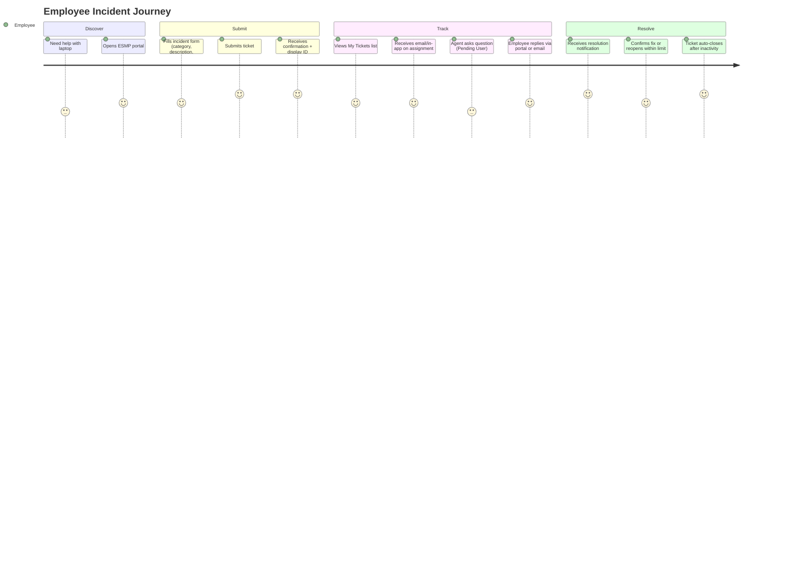
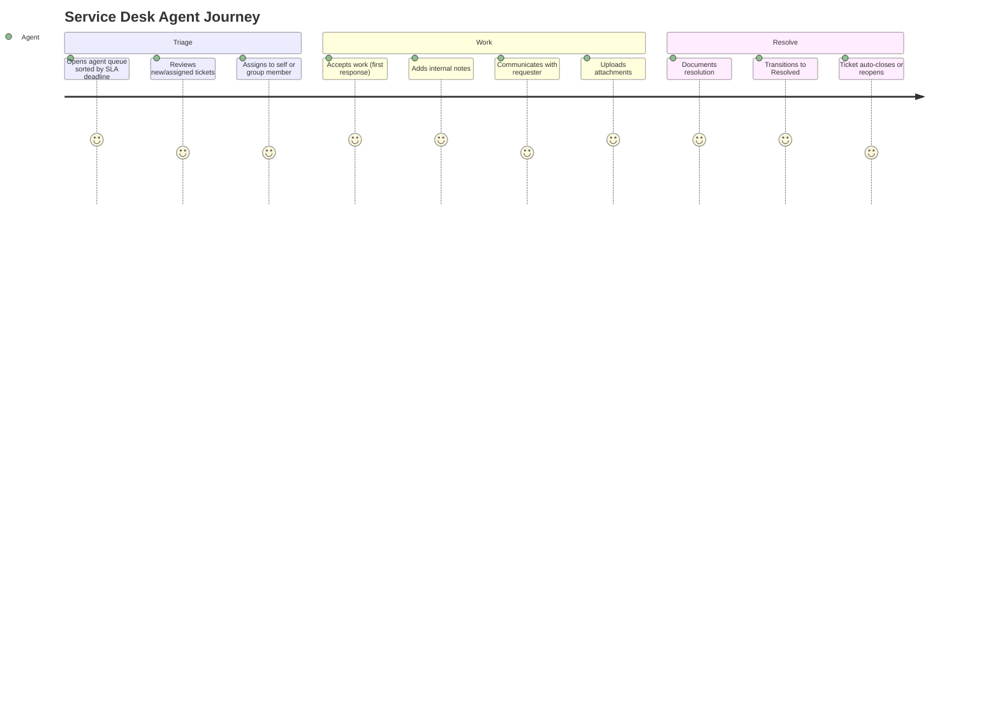
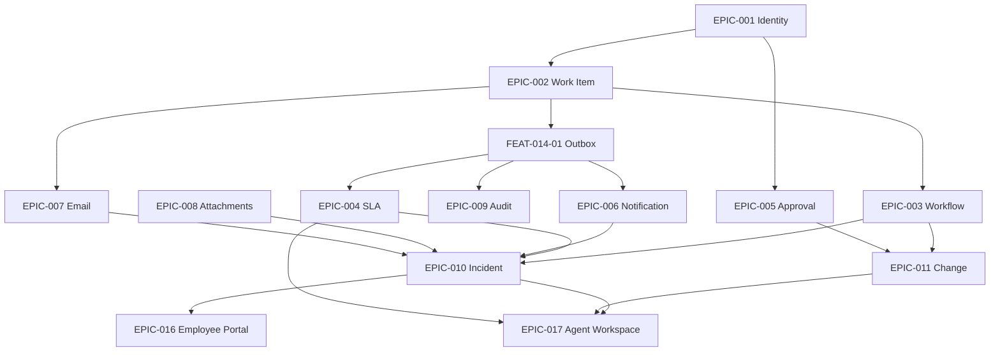
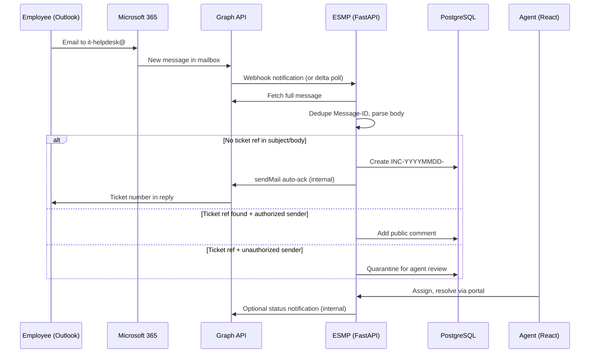

# Enterprise Service Management Platform (ESMP)
## Product Requirements Document (PRD)

| Attribute | Value |
|---|---|
| Document Version | 1.2 |
| Status | Approved for Build |
| Author | Principal Product Management (derived from Architecture v2.0) |
| Date | 2026-06-23 |
| Architecture Baseline | [ESMP_ARCHITECTURE_v2.md](../architecture/ESMP_ARCHITECTURE_v2.md) |
| Build Prompts | [ESMP_BUILD_PROMPTS.md](./ESMP_BUILD_PROMPTS.md) |
| Supersedes | PRD v1.1 |

> **Authority**: This PRD is derived from `ESMP_ARCHITECTURE_v2.md`. It does not redesign architecture, specify APIs, database schemas, or code. It translates architecture into product requirements for development planning.
>
> **v1.2 (2026-06-23)**: Refocused on product north star — ServiceNow-style **Incident + Change** modules, **internal Microsoft 365 / Outlook** email-to-ticket (Graph API, no external SMTP), **FastAPI + React + PostgreSQL** stack. Added §0 North Star, §23 Internal Email Integration, §24 Technology Stack. Primary build guide: [ESMP_BUILD_PROMPTS.md](./ESMP_BUILD_PROMPTS.md).
>
> **v1.1**: Priority scoring (P0†), Definition of Ready, R0 sequencing, team sizing, CSAT/search/migration.

---

# Table of Contents

0. [Product North Star](#0-product-north-star)
1. [Product Vision](#1-product-vision)
2. [User Personas](#2-user-personas)
3. [Employee Journey](#3-employee-journey)
4. [Agent Journey](#4-agent-journey)
5. [Manager Journey](#5-manager-journey)
6. [Administrator Journey](#6-administrator-journey)
7. [Complete Epics](#7-complete-epics)
8. [Complete Features](#8-complete-features)
9. [Complete User Stories](#9-complete-user-stories)
10. [Acceptance Criteria](#10-acceptance-criteria)
11. [Business Rules](#11-business-rules)
12. [Screen Inventory](#12-screen-inventory)
13. [Navigation Structure](#13-navigation-structure)
14. [MVP Scope](#14-mvp-scope)
15. [Phase 2 Scope](#15-phase-2-scope)
16. [Phase 3 Scope](#16-phase-3-scope)
17. [Release Plan](#17-release-plan)
18. [Feature Prioritization Matrix](#18-feature-prioritization-matrix)
19. [Dependencies](#19-dependencies)
20. [Success Metrics](#20-success-metrics)
21. [Definition of Ready & Done](#21-definition-of-ready--done)
22. [Team Capacity & Effort Sizing](#22-team-capacity--effort-sizing)
23. [Internal Outlook Email Integration](#23-internal-outlook-email-integration)
24. [Technology Stack](#24-technology-stack)

**Implementation references** (optional): [Appendix D–G](#appendix-d-r0-sprint-1-backlog-implementation-reference) — phase backlog cards for engineering.

**AI build prompts**: Use [ESMP_BUILD_PROMPTS.md](./ESMP_BUILD_PROMPTS.md) for copy-paste master and phase-wise implementation prompts.

---

## 0. Product North Star

### 0.1 The Problem We Are Solving

Today, employees contact IT by sending email from **Microsoft Outlook** to a shared support mailbox. Those conversations are:

- **Lost** when mailboxes overflow or threads are forwarded informally
- **Untracked** — no ticket number, no SLA, no owner
- **Unaudited** — no record of who changed what
- **Invisible to management** — no dashboards, no MTTR, no change governance

This is the same problem ServiceNow and Jira Service Management solve. ESMP replaces **Outlook as the system of record** with a **tracked work item** for every request — while **keeping email as a first-class channel** employees already use.

### 0.2 What We Are Building (v1)

| Dimension | Decision |
|---|---|
| **Product type** | Internal ITSM platform (ServiceNow / Jira SM class) |
| **Major modules (now)** | **Incident Management** + **Change Management** |
| **Primary intake channels** | (1) **Internal Outlook email** to shared mailbox, (2) **React web portal** |
| **Email constraint** | **Microsoft 365 tenant only** — no external SMTP (SendGrid, etc.); all mail via **Microsoft Graph API** |
| **Tech stack** | **FastAPI** (backend) · **React** (frontend) · **PostgreSQL** (database) · Redis + Celery (async) |
| **Core pattern** | Generic **Work Item** — incidents and changes are extensions, not separate silos |
| **Future (not v1)** | Service catalog, KB, CMDB, AI copilot, mobile app |

### 0.3 Why Email Integration Is P0 (Not Optional)

| ServiceNow behavior | ESMP requirement |
|---|---|
| Inbound email action creates incident | Graph webhook/poll → create `INC-YYYYMMDD-####` |
| Reply with ticket ref updates record | Thread detection → public comment |
| Auto-reply with ticket number | Graph `sendMail` from shared mailbox (internal) |
| Agent works in UI | React agent queue + SLA |

**Success criterion G1**: 100% of emails to the support mailbox become tracked tickets within 3 months of launch.

### 0.4 Current Codebase Context

| Asset | Location | Role |
|---|---|---|
| **Email-to-ticket prototype (IMAP)** | `server/src/services/emailInbound.js` | Proves create-vs-comment logic; **replace transport with Graph for production** |
| **Existing ITSM (Node/React/Prisma)** | `server/`, `client/` | Reference implementation; target platform is **FastAPI + PostgreSQL** per architecture |
| **Architecture v2** | `docs/architecture/ESMP_ARCHITECTURE_v2.md` | Engineering source of truth |
| **Build prompts** | `docs/product/ESMP_BUILD_PROMPTS.md` | Phase-wise AI implementation prompts |

### 0.5 Delivery Phases (Product View)

| Phase | Focus | Outcome |
|---|---|---|
| **Phase 1** | Platform + Incident + **Outlook/Graph email** | No more lost support emails |
| **Phase 2** | Change + SLA + CAB approvals | Governed infrastructure changes |
| **Phase 3** | Hardening + cutover | Portal is system of record; G8 >40% portal adoption |

**Note**: [ESMP_BUILD_PROMPTS.md](./ESMP_BUILD_PROMPTS.md) uses three **implementation** phases (Foundation+Incident+Email → Change+SLA → Hardening). PRD §15–16 **enterprise expansion** phases (catalog, KB, CMDB) follow MVP go-live.

| Build prompt phase | Delivers | PRD sections |
|---|---|---|
| Build Phase 1 | Platform + Incident + Graph email | §14 MVP (partial), §23 |
| Build Phase 2 | Change + SLA + CAB | §14 MVP (remainder) |
| Build Phase 3 | Production hardening + email cutover | §14.4, EPIC-025, §16 |
| PRD Phase 2 (post-MVP) | Service catalog, KB, Problem | §15 |
| PRD Phase 3 (enterprise) | CMDB, AI, mobile | §16 |

Detailed phase prompts: [ESMP_BUILD_PROMPTS.md §5](./ESMP_BUILD_PROMPTS.md).

---

## 1. Product Vision

### 1.1 Vision Statement

A single, unified service management platform where every employee in the organization can request help, track progress, and receive service — without ever needing to know which team handles their request. The platform evolves from an IT service desk into the enterprise-wide service backbone, managing everything from password resets to infrastructure changes to employee onboarding, all governed by consistent policies, workflows, and SLAs.

### 1.2 Strategic Product Tenets

| # | Tenet | Product Implication |
|---|---|---|
| T1 | Platform First, Modules Second | Every feature builds on shared engines (Workflow, SLA, Approval, Notification, Audit) — never module-specific hardcoding |
| T2 | Metadata-Driven Customization | Fields, workflows, forms, and notifications are configurable without code releases |
| T3 | Frictionless Integration | **Internal Outlook email** and portal are co-equal intake paths; future: Teams, Slack |
| T4 | Resilient Channel Processing | Email-to-ticket is as reliable as portal submission, with deduplication and anti-spoofing |
| T5 | Audit by Default | Every mutation is traceable; compliance is built-in, not bolted-on |
| T6 | Human-in-the-Loop Service | Automation accelerates agents; critical decisions (approvals, major incidents) retain human authority |

### 1.3 Stakeholder Vision Statements

| Stakeholder | Vision |
|---|---|
| **Employees (Requesters)** | One place to request anything, track everything, and get service fast |
| **Service Agents** | Configurable workflows, automated assignments, real-time visibility into workload and SLA performance |
| **Managers** | Complete audit trail, trend analysis, and data-driven resource planning |
| **Organization** | Architecture that absorbs new service domains (HR, Finance, Facilities) without friction |

### 1.4 Business Goals (Normative)

| ID | Goal | Metric | Target |
|---|---|---|---|
| G1 | Eliminate lost requests | Email tickets not tracked | 100% within 3 months of launch |
| G2 | Establish service accountability | Tickets with assigned owner | 100% compliance |
| G3 | Meet SLA commitments | SLA breach rate | <5% |
| G4 | Provide audit readiness | Actions logged immutably | 100% audit coverage |
| G5 | Reduce resolution time | MTTR reduction | 40% within 6 months |
| G6 | Enable data-driven decisions | Manager dashboard access | 100% team coverage |
| G7 | Support growth | User scale | 100 → 5,000 users without rearchitecture |
| G8 | Reduce email volume | Portal-created tickets | >60% within 12 months |

### 1.5 Phase 1 Product Scope (Vision Anchor)

Phase 1 delivers **Incident Management** and **Change Management** on a shared **Work Item** platform core. It replaces untracked Outlook threads with a centralized, workflow-driven, auditable system.

**Email and portal are co-equal intake paths from day one** — employees may continue using Outlook; every message to the support mailbox must create or update a ticket.

### 1.6 Internal Outlook Email Strategy (Normative)

| Principle | Requirement |
|---|---|
| **Tenant-bound mail** | All email read/write stays inside **Microsoft 365** via Graph API |
| **No external SMTP** | Do not use SendGrid, Mailgun, or open SMTP relay for production |
| **Shared mailbox** | Dedicated address (e.g. `it-helpdesk@company.com`) is the single intake point |
| **Graph over IMAP** | Production: Graph webhooks + delta poll fallback; IMAP acceptable for local dev only |
| **Thread preservation** | Ticket ref in subject (`INC-YYYYMMDD-####`) + `In-Reply-To` / `References` + `Message-ID` dedup |
| **Auto-ack** | Internal reply with ticket number; does **not** count as agent first response (BR-INC-004) |
| **Parallel run** | Minimum 4 weeks where email and portal both active before cutover (EPIC-025) |

Full product specification: [§23 Internal Outlook Email Integration](#23-internal-outlook-email-integration).

---

## 2. User Personas

### 2.1 Persona: Employee / Requester — "Priya Sharma"

| Attribute | Detail |
|---|---|
| Role | `requester` (default for all employees) |
| Department | Finance |
| Technical Skill | Low–medium; prefers simple forms over email threads |
| Goals | Report IT issues quickly, know status without chasing, receive timely updates |
| Pain Points | Lost emails in Outlook threads, no ticket number, no SLA visibility, must call to check status |
| Primary Channels | **Outlook email to support mailbox (preferred today)**, employee portal, email reply to notifications |
| Key Screens | Home, Create Incident, My Tickets, Ticket Detail, Notifications |

### 2.2 Persona: Service Desk Agent — "Marcus Chen"

| Attribute | Detail |
|---|---|
| Role | `service_desk_agent` |
| Department | IT Service Desk |
| Technical Skill | High; comfortable with queues, filters, internal notes |
| Goals | Resolve tickets within SLA, manage queue efficiently, document resolutions |
| Pain Points | Context switching, duplicate tickets, unclear priority, SLA surprises |
| Primary Channels | Agent workspace, email notifications |
| Key Screens | Agent Queue, Ticket Detail (agent view), Bulk Actions, Saved Views |

### 2.3 Persona: Incident Manager — "Elena Rodriguez"

| Attribute | Detail |
|---|---|
| Role | `incident_manager` |
| Department | IT Operations |
| Technical Skill | Expert; owns major incident protocol |
| Goals | Coordinate P1/critical incidents, freeze SLAs appropriately, drive post-incident review |
| Pain Points | Fragmented communication during outages, SLA noise during major incidents |
| Primary Channels | Agent workspace, executive notifications, collaboration bridge (Teams/Slack) |
| Key Screens | Major Incident Console, Related Incidents, Escalation History, PIR |

### 2.4 Persona: Change Manager — "David Okonkwo"

| Attribute | Detail |
|---|---|
| Role | `change_manager` |
| Department | IT Change Management |
| Technical Skill | Expert; understands CAB, risk, and scheduling |
| Goals | Govern changes, minimize risk, maintain change calendar visibility |
| Pain Points | Unauthorized changes, scheduling conflicts, incomplete plans |
| Primary Channels | Change workspace, CAB approval queue |
| Key Screens | Change Calendar, Change Detail, Risk Assessment, CAB Queue, Collision Warnings |

### 2.5 Persona: CAB Member / Approver — "Sarah Kim"

| Attribute | Detail |
|---|---|
| Role | `cab_member`, `approver` |
| Department | Various (Architecture, Security, Business) |
| Technical Skill | Medium; approves via portal or email link |
| Goals | Review change requests efficiently, delegate when unavailable |
| Pain Points | Approval bottlenecks, unclear risk context, missed deadlines |
| Primary Channels | Approval inbox, email notifications |
| Key Screens | My Approvals, Approval Detail, Delegation Settings |

### 2.6 Persona: Service Desk Manager — "James Whitfield"

| Attribute | Detail |
|---|---|
| Role | `service_desk_manager`, `team_lead` |
| Department | IT Service Desk |
| Technical Skill | High; configures SLAs, workflows, reports |
| Goals | Team performance, SLA compliance, workload balancing, escalation management |
| Pain Points | No real-time visibility, manual reporting, uneven workload |
| Primary Channels | Manager dashboard, reports |
| Key Screens | Team Dashboard, SLA Config, Workflow Config, Reports, Escalation Policies |

### 2.7 Persona: System Administrator — "Alex Morgan"

| Attribute | Detail |
|---|---|
| Role | `admin`, `super_admin` |
| Department | IT Platform Engineering |
| Technical Skill | Expert |
| Goals | Configure platform, manage users/groups/roles, maintain integrations |
| Pain Points | Complex configuration sprawl, integration failures, security compliance |
| Primary Channels | Admin console |
| Key Screens | User Management, Group Management, Role/Permission Matrix, Email Integration Config, System Health |

### 2.8 Persona: Auditor — "Rita Fernandez"

| Attribute | Detail |
|---|---|
| Role | `auditor` |
| Department | Internal Audit / Compliance |
| Technical Skill | Medium |
| Goals | Verify immutable audit trail, export evidence, search/filter actions |
| Pain Points | Incomplete logs, inability to prove tamper-evidence |
| Primary Channels | Audit console (read-only) |
| Key Screens | Audit Log Search, Audit Export, Hash-Chain Integrity View |

### 2.9 Persona: Report Viewer — "Tom Hughes"

| Attribute | Detail |
|---|---|
| Role | `report_viewer` |
| Department | Executive / Business |
| Technical Skill | Low |
| Goals | View operational dashboards and trends without ticket access |
| Primary Channels | Reports portal |
| Key Screens | Executive Dashboard, Trend Reports |

### 2.10 Persona Edge Cases (Negative & Abuse Paths)

| Persona | Edge Case | Product Response |
|---|---|---|
| Requester | Spams duplicate tickets (>20/day) | BR-ABUSE-001 rate limit + manager alert |
| Requester | Reopens repeatedly at max limit | BR-INC-005 blocks; agent offers new ticket |
| Agent | Skips SLA pause when awaiting user | `has_reason` guard required (BR-ABUSE-002) |
| Agent | Overwrites concurrent edit | lock_version 409 + merge UI (FEAT-017-03) |
| External sender | Spoofs ticket key in email | Quarantine + security alert (BR-EMAIL-003) |
| Approver | Creates delegation loop A→B→A | Rejected 422 (BR-APPR-003) |

---

## 3. Employee Journey

### 3.1 Journey Map: Report an IT Issue



### 3.2 Journey Stages

| Stage | Actor Actions | System Responses | Touchpoints |
|---|---|---|---|
| **Discover** | Employee emails `it-helpdesk@` from Outlook OR opens portal | Graph ingests mail; portal shows home | Outlook, SCR-EMP-001, SCR-EMP-002 |
| **Submit** | Email body becomes description OR form submission | `INC-YYYYMMDD-XXXX` generated; priority computed; SLA started; **internal auto-ack via Graph** | Email pipeline, SCR-EMP-002 |
| **Track** | Views ticket status; responds to agent questions; adds watchers optionally | Status transitions; notifications on assign, comment, status change; activity timeline updated | SCR-EMP-004 My Tickets, SCR-EMP-003, Notifications |
| **Resolve** | Reviews resolution; reopens if needed (within limit) or accepts | Resolved → Closed after configurable inactivity (default 5 days + 24h warning); reopen restarts SLA | SCR-EMP-003, Email reply |
| **Alternative: Email-first** | Sends email to support address | System creates ticket; auto-ack sent; employee can reply to thread | Email only until portal visit |

### 3.3 Employee Journey — Change Request (Observer)

Employees typically do not create changes. They may:
- Be notified as stakeholders of scheduled changes affecting their systems
- Link an incident to a pending change (agent-driven)
- View change status if added as watcher

---

## 4. Agent Journey

### 4.1 Journey Map: Triage and Resolve Incident



### 4.2 Journey Stages

| Stage | Actor Actions | System Responses | Touchpoints |
|---|---|---|---|
| **Queue Review** | Opens personal/group queue; uses saved views; sorts by `resolution_deadline` | Queue shows SLA indicators, priority badges, breach warnings | SCR-AGT-001 Agent Queue, SCR-AGT-002 Saved Views |
| **Triage** | Reviews ticket; sets category/subcategory; adjusts priority (with audit if override); assigns | Priority matrix applied; SLA policy matched; assignment notifications sent | SCR-AGT-003 Ticket Detail (Agent) |
| **First Response** | Clicks "Start Work" OR posts public comment OR assigns to individual | Response SLA stops; `first_response` event emitted | SCR-AGT-003 |
| **Investigation** | Internal notes; pend to user/vendor/change; link related tickets; escalate | SLA pauses/resumes per state; escalation rules fire on timeout | SCR-AGT-003, SCR-AGT-004 Relations |
| **Resolution** | Enters resolution, resolution category; resolves parent (children auto-resolve) | Resolution SLA stops; requester notified; activity timeline complete | SCR-AGT-003 |
| **Major Incident** | Declares major incident (or auto on P1) | MI protocol: SLA freeze on related incidents, executive notifications, collaboration bridge | SCR-AGT-005 Major Incident Console |

### 4.3 Agent Journey — Change Implementation

| Stage | Actions | System |
|---|---|---|
| Draft | Change owner creates change with plans | Draft state; validation of required fields |
| Submit | Completes implementation/validation/rollback plans | Risk scoring computed; routed to review |
| Approve | CAB reviews (agent may facilitate, not approve unless CAB member) | Approval chain; notifications |
| Implement | Executes during scheduled window | State → Implementation → Validation |
| Close | PIR completed (normal); emergency PIR post-closure | Metrics tracked; calendar updated |

---

## 5. Manager Journey

### 5.1 Journey Map: Daily Operations Oversight

| Stage | Manager Actions | System Support | Screens |
|---|---|---|---|
| **Morning Review** | Opens team dashboard; reviews breached/at-risk tickets | Real-time SLA metrics; materialized views with staleness indicator | SCR-MGR-001 Team Dashboard |
| **Workload Balance** | Reassigns overloaded agents; reviews escalation queue | Assignment audit; escalation history | SCR-MGR-002 Workload View |
| **SLA Management** | Reviews breach trends; adjusts policies if needed | SLA policy config; breach reports | SCR-MGR-003 SLA Config |
| **Change Governance** | Reviews change calendar; approves high-risk changes (if CAB) | Collision detection; risk scores | SCR-MGR-004 Change Calendar |
| **Reporting** | Exports weekly metrics for leadership | Scheduled exports; CSV/PDF | SCR-MGR-005 Reports |
| **Major Incident** | Declares or oversees MI; receives 30-min executive updates | MI protocol automation | SCR-MGR-006 Major Incident Overview |

### 5.2 Manager Decision Points

| Decision | Trigger | Options | Audit Required |
|---|---|---|---|
| Priority override | Agent escalation or business impact | Override matrix result with justification | Yes |
| SLA override | Business exception | Extend deadline with reason | Yes (P2 feature) |
| Escalation policy change | Recurring breaches | Modify thresholds/targets | Yes |
| Workflow activation | New process rollout | Feature-flag pilot group | Yes |
| Bulk reassignment | Team absence / surge | BulkJob with per-row validation | Yes (summary per entity) |

---

## 6. Administrator Journey

### 6.1 Journey Map: Platform Setup and Operations

| Phase | Administrator Actions | Deliverables |
|---|---|---|
| **Initial Setup** | Configure identity (users, groups, roles); set business calendars; define SLA policies | Baseline RBAC; working calendars |
| **Workflow Config** | Define incident/change workflows; validate DAG (no cycles) | Active workflow definitions |
| **Integration** | Register Azure AD app; connect Graph to shared mailbox; verify webhook handshake; **no external SMTP** | Email ingestion live on internal M365 only |
| **Notification Templates** | Map events to templates per channel | Email + in-app templates |
| **Go-Live** | Run production checklist (Section 52 of architecture) | Verified security, idempotency, audit |
| **Ongoing Ops** | Monitor Graph subscription renewal; rotate secrets; review audit exports | Healthy integrations |

### 6.2 Administrator Screens (Primary)

| Screen ID | Purpose |
|---|---|
| SCR-ADM-001 | User Management (CRUD, role assignment, kill-session) |
| SCR-ADM-002 | Group Management (assignment, CAB, approval groups) |
| SCR-ADM-003 | Role & Permission Matrix |
| SCR-ADM-004 | Workflow Designer (states, transitions, guards, hooks) |
| SCR-ADM-005 | SLA Policy Manager |
| SCR-ADM-006 | Business Calendar Manager |
| SCR-ADM-007 | Notification Template Manager |
| SCR-ADM-008 | Email Integration / Graph Config |
| SCR-ADM-009 | Approval Policy Manager |
| SCR-ADM-010 | Feature Flag Manager |
| SCR-ADM-011 | System Health Dashboard |
| SCR-ADM-012 | Audit Configuration (retention, export) |
| SCR-ADM-013 | Escalation & Delegation Policies |
| SCR-ADM-014 | Custom Fields Schema Manager |

---

## 7. Complete Epics

| Epic ID | Epic Name | Description | MVP | Owner Module |
|---|---|---|---|---|
| EPIC-001 | Identity & Access Management | Authentication, RBAC, groups, sessions, quiet hours | Yes | core.identity |
| EPIC-002 | Work Item Core Platform | Generic work item CRUD, relations, comments, watchers, tasks, worklogs | Yes | core.workitem |
| EPIC-003 | Workflow Engine | Data-driven state machines, transitions, guards, hooks | Yes | core.workflow |
| EPIC-004 | SLA Engine | Policies, business calendars, pause/resume, breach, escalation | Yes | core.sla |
| EPIC-005 | Approval Engine | Chains, parallel/sequential, delegation, quorum, expiry | Yes | core.approval |
| EPIC-006 | Notification Engine | Templates, channels, preferences, quiet hours, digest | Yes | core.notification |
| EPIC-007 | Email Integration | Graph API ingestion, threading, quarantine, lifecycle | Yes | core.email |
| EPIC-008 | Attachment Service | Upload, scan, preview, classification, signed URLs | Yes | core.attachment |
| EPIC-009 | Audit & Compliance | Immutable logging, hash-chain, export, search | Yes | core.audit |
| EPIC-010 | Incident Management | Full incident lifecycle, major incident, escalations | Yes | incident |
| EPIC-011 | Change Management | Normal/emergency changes, CAB, risk, calendar, collision | Yes | change |
| EPIC-012 | Reporting & Dashboards | Operational dashboards, exports, scheduled reports | Partial | core.reporting |
| EPIC-013 | Search | Full-text search (PostgreSQL MVP; OpenSearch Phase 2) | Partial | core.search |
| EPIC-014 | Platform Services | Idempotency, feature flags, bulk jobs, webhooks | Partial | core.* |
| EPIC-015 | Admin & Configuration | Admin consoles for all configurable entities | Yes | Multiple |
| EPIC-016 | Employee Portal Experience | Requester-facing UI | Yes | Frontend |
| EPIC-017 | Agent Workspace | Agent queue, ticket detail, saved views, templates | Yes | Frontend |
| EPIC-018 | Manager Console | Team dashboards, SLA/escalation oversight | Partial | Frontend |
| EPIC-019 | Service Catalog & Requests | Catalog, REQ/RITM/SCTASK fulfillment | No | service_request |
| EPIC-020 | Knowledge Base | Articles, categories, feedback, versioning | No | knowledge |
| EPIC-021 | Problem Management | RCA, known errors, workarounds | No | problem |
| EPIC-022 | Asset & CMDB | Assets, CIs, relationships, discovery | No | asset, cmdb |
| EPIC-023 | Advanced Integrations | Teams, Slack, mobile push, on-call | No | core.integration |
| EPIC-024 | AI Copilot & Automation | Auto-categorize, suggest, anomaly detection | No | ai |
| EPIC-025 | Go-Live, Migration & Cutover | User seeding, parallel run, email decommission, legacy import | Yes | cross-cutting |

---

## 8. Complete Features

Features are organized by Epic. Each row includes Priority (P0=Must, P1=Should, P2=Could) and architectural requirement ID cross-reference.

### EPIC-001: Identity & Access Management

| Feature ID | Feature Name | Priority | Arch Ref | Dependencies |
|---|---|---|---|---|
| FEAT-001-01 | User Authentication (JWT) | P0 | ENT-018 | None |
| FEAT-001-02 | Role-Based Access Control | P0 | RBAC §19 | FEAT-001-01 |
| FEAT-001-03 | Group Management | P0 | §19 | FEAT-001-02 |
| FEAT-001-04 | Scope-Based Ticket Visibility | P0 | §19.3 | FEAT-001-02, FEAT-002-01 |
| FEAT-001-05 | Session Kill on Credential/Role Change | P0 | ENT-018, §50.16 | FEAT-001-01 |
| FEAT-001-06 | User Profile & Preferences | P1 | NOTIF-005 | FEAT-001-01 |
| FEAT-001-07 | Quiet Hours Configuration | P1 | NOTIF-011, F5 | FEAT-001-06, FEAT-006-08 |
| FEAT-001-08 | SSO Readiness (Abstracted Auth Provider) | P2 | §23.1 | FEAT-001-01 |
| FEAT-001-09 | i18n String Externalization (locale-ready UI) | P0 | ENT-003 | FEAT-016-01 |

### EPIC-002: Work Item Core Platform

| Feature ID | Feature Name | Priority | Arch Ref | Dependencies |
|---|---|---|---|---|
| FEAT-002-01 | Work Item CRUD | P0 | §6.1 | FEAT-001-02 |
| FEAT-002-02 | Display ID Generation | P0 | INC-001, §50.3 | FEAT-002-01 |
| FEAT-002-03 | Optimistic Concurrency (lock_version) | P0 | ENT-015, §50.1 | FEAT-002-01 |
| FEAT-002-04 | Idempotency on Mutations | P0 | ENT-016, §50.2 | FEAT-002-01 |
| FEAT-002-05 | Comments (Public & Internal) | P0 | INC-015, INC-016 | FEAT-002-01 |
| FEAT-002-06 | Watchers | P1 | INC-018 | FEAT-002-01, FEAT-006-01 |
| FEAT-002-07 | Work Item Relations | P1 | INC-012 | FEAT-002-01 |
| FEAT-002-08 | Tasks (Sub-tasks) | P1 | §6.3 | FEAT-002-01, FEAT-003-01 |
| FEAT-002-09 | Worklogs (Time Tracking) | P1 | F4 | FEAT-002-01 |
| FEAT-002-10 | Ticket Templates | P1 | INC-027, F3 | FEAT-002-01 |
| FEAT-002-11 | Saved Views / Personal Queues | P1 | INC-028, F2 | FEAT-002-01 |
| FEAT-002-12 | Custom Fields with Schema Versioning | P1 | ENT-012, §50.10 | FEAT-002-01 |
| FEAT-002-13 | Activity Timeline | P0 | INC-024 | FEAT-002-01, FEAT-009-01 |
| FEAT-002-14 | Bulk Operations (BulkJob) | P2 | INC-023, F13 | FEAT-002-03, FEAT-009-01 |

### EPIC-003: Workflow Engine

| Feature ID | Feature Name | Priority | Arch Ref | Dependencies |
|---|---|---|---|---|
| FEAT-003-01 | Data-Driven Workflow Definitions | P0 | §13.3 | FEAT-002-01 |
| FEAT-003-02 | Incident State Machine | P0 | §13.1, §14.1 | FEAT-003-01, FEAT-010-01 |
| FEAT-003-03 | Change State Machine | P0 | §13.2 | FEAT-003-01, FEAT-011-01 |
| FEAT-003-04 | Transition Guards | P0 | §14.1 | FEAT-003-01 |
| FEAT-003-05 | Transition Hooks (SLA, Notify, First Response) | P0 | §14.1, §50.4 | FEAT-003-01, FEAT-004-01, FEAT-006-01 |
| FEAT-003-06 | DAG Validation on Workflow Save | P0 | §13.3 | FEAT-003-01 |
| FEAT-003-07 | Emergency Change Abbreviated Workflow | P0 | §14.2 | FEAT-003-03, FEAT-011-04 |
| FEAT-003-08 | Auto-Close Sweep | P0 | §50.9 | FEAT-003-02 |
| FEAT-003-09 | Custom Statuses | P1 | ENT-013 | FEAT-003-01 |

### EPIC-004: SLA Engine

| Feature ID | Feature Name | Priority | Arch Ref | Dependencies |
|---|---|---|---|---|
| FEAT-004-01 | SLA Policy Configuration | P0 | SLA-001, SLA-002 | FEAT-003-01 |
| FEAT-004-02 | Business Calendars | P0 | SLA-004 | FEAT-004-01 |
| FEAT-004-03 | Response & Resolution Tracking | P0 | SLA-003 | FEAT-004-01, FEAT-002-01 |
| FEAT-004-04 | First Response Semantics (Human Only) | P0 | SLA-014, §50.4 | FEAT-004-03, FEAT-003-05 |
| FEAT-004-05 | Pause/Resume Conditions | P0 | SLA-006, SLA-007 | FEAT-004-03, FEAT-003-02 |
| FEAT-004-06 | Breach Detection & Notification | P0 | SLA-008 | FEAT-004-03, FEAT-006-01 |
| FEAT-004-07 | SLA Status Display on Ticket | P0 | SLA-010 | FEAT-004-03 |
| FEAT-004-08 | Calendar Snapshot at SLA Start | P0 | §21.6 | FEAT-004-02 |
| FEAT-004-09 | Denormalized resolution_deadline | P0 | §50.11 | FEAT-004-03 |
| FEAT-004-10 | Pre-Breach Warnings (50%, 75%) | P1 | SLA-013 | FEAT-004-06 |
| FEAT-004-11 | Escalation on Breach | P1 | SLA-009 | FEAT-004-06, FEAT-010-08 |
| FEAT-004-12 | Major Incident SLA Freeze | P1 | SLA-012, §21.7 | FEAT-010-06, FEAT-004-03 |
| FEAT-004-13 | SLA Override | P2 | SLA-011 | FEAT-004-01 |

### EPIC-005: Approval Engine

| Feature ID | Feature Name | Priority | Arch Ref | Dependencies |
|---|---|---|---|---|
| FEAT-005-01 | Approval Policy Configuration | P0 | APPR-001 | FEAT-001-03 |
| FEAT-005-02 | Sequential Approval Chains | P0 | APPR-002 | FEAT-005-01 |
| FEAT-005-03 | Parallel Approvals (Any/All) | P0 | APPR-003 | FEAT-005-01 |
| FEAT-005-04 | Conditional Routing | P0 | APPR-007 | FEAT-005-01 |
| FEAT-005-05 | Approver Notifications | P0 | APPR-008 | FEAT-005-01, FEAT-006-01 |
| FEAT-005-06 | Decision Recording | P0 | APPR-011 | FEAT-005-01 |
| FEAT-005-07 | Requester Decision Notification | P0 | APPR-009 | FEAT-005-06, FEAT-006-01 |
| FEAT-005-08 | Approval Delegation | P1 | APPR-004, §38 | FEAT-005-01 |
| FEAT-005-09 | Approval Expiry & Escalation | P1 | APPR-005, APPR-006 | FEAT-005-01 |
| FEAT-005-10 | Quorum Deadlock Resolution | P1 | APPR-013, §50.8 | FEAT-005-03 |
| FEAT-005-11 | Multi-Level Tiered Approvals | P1 | APPR-012 | FEAT-005-02 |
| FEAT-005-12 | Email Reply Approval (Signed Link) | P2 | APPR-010, F6 | FEAT-005-06, FEAT-007-01 |
| FEAT-005-13 | Consumer Idempotency on Decisions | P0 | APPR-014, §50.7 | FEAT-005-06 |

### EPIC-006: Notification Engine

| Feature ID | Feature Name | Priority | Arch Ref | Dependencies |
|---|---|---|---|---|
| FEAT-006-01 | Event-Driven Notification Dispatch | P0 | NOTIF-001 | FEAT-014-01 (Outbox) |
| FEAT-006-02 | Email Channel | P0 | NOTIF-002 | FEAT-006-01 |
| FEAT-006-03 | In-App Channel (SSE/WS) | P0 | NOTIF-002 | FEAT-006-01 |
| FEAT-006-04 | Template Management | P0 | NOTIF-003, NOTIF-004 | FEAT-006-01 |
| FEAT-006-05 | Delivery Status Logging | P0 | NOTIF-009 | FEAT-006-01 |
| FEAT-006-06 | Skip Inactive Users | P0 | NOTIF-008 | FEAT-006-01, FEAT-001-01 |
| FEAT-006-07 | Consumer Idempotency | P0 | NOTIF-012, §50.7 | FEAT-006-01 |
| FEAT-006-08 | Quiet Hours & Digest Batching | P1 | NOTIF-011, §50.12 | FEAT-001-07, FEAT-006-01 |
| FEAT-006-09 | User Notification Preferences | P1 | NOTIF-005 | FEAT-006-01 |
| FEAT-006-10 | @Mention Notifications | P1 | NOTIF-007 | FEAT-002-05 |
| FEAT-006-11 | Failed Delivery Retry (max 3) | P1 | NOTIF-010 | FEAT-006-02 |
| FEAT-006-12 | Daily Digest | P2 | NOTIF-006 | FEAT-006-08 |

### EPIC-007: Email Integration

| Feature ID | Feature Name | Priority | Arch Ref | Dependencies |
|---|---|---|---|---|
| FEAT-007-01 | Microsoft Graph Connection (internal M365) | P0 | EMAIL-001 | FEAT-001-01, §23 |
| FEAT-007-02 | Webhook + Polling Fallback | P0 | EMAIL-002 | FEAT-007-01 |
| FEAT-007-03 | Webhook Validation Handshake | P0 | EMAIL-003 | FEAT-007-02 |
| FEAT-007-04 | Email-to-Ticket Creation | P0 | EMAIL-004 | FEAT-002-01, FEAT-007-02 |
| FEAT-007-05 | Ticket Reference Detection | P0 | EMAIL-005 | FEAT-007-04 |
| FEAT-007-06 | Authorized Reply Updates | P0 | EMAIL-006, §50.5 | FEAT-007-05, FEAT-002-05 |
| FEAT-007-07 | Attachment Extraction | P0 | EMAIL-007 | FEAT-007-04, FEAT-008-01 |
| FEAT-007-08 | Auto-Acknowledgement (No Response SLA Stop) | P0 | EMAIL-008, §50.4 | FEAT-007-04, FEAT-006-02 |
| FEAT-007-09 | OOO / Delivery Failure / Spam Handling | P0/P1 | EMAIL-009–011 | FEAT-007-04 |
| FEAT-007-10 | Message-ID Deduplication | P0 | EMAIL-012, §50.2 | FEAT-007-04 |
| FEAT-007-11 | Email Thread Mapping | P0 | EMAIL-017 | FEAT-007-06 |
| FEAT-007-12 | Full Email History Storage | P0 | EMAIL-018 | FEAT-007-04 |
| FEAT-007-13 | Graph Lifecycle (Renewal, Secret, Throttle, Delta) | P0 | EMAIL-019–022 | FEAT-007-02 |
| FEAT-007-14 | Quarantine Suspicious Replies | P1 | EMAIL-023 | FEAT-007-06 |
| FEAT-007-15 | Forwarded Email Parsing | P1 | EMAIL-013 | FEAT-007-04 |
| FEAT-007-16 | Mailbox Downtime Handling | P0 | EMAIL-016 | FEAT-007-13 |

### EPIC-008: Attachment Service

| Feature ID | Feature Name | Priority | Arch Ref | Dependencies |
|---|---|---|---|---|
| FEAT-008-01 | File Upload (25MB default) | P0 | ATT-001 | FEAT-002-01 |
| FEAT-008-02 | Malware Scanning (ClamAV) | P0 | ATT-002, EMAIL-014 | FEAT-008-01 |
| FEAT-008-03 | File Type Allowlist | P0 | ATT-003 | FEAT-008-01 |
| FEAT-008-04 | Secure Storage (UUID keys) | P0 | ATT-004 | FEAT-008-01 |
| FEAT-008-05 | Signed Download URLs (15 min) | P0 | ATT-010 | FEAT-008-01 |
| FEAT-008-06 | Data Classification Labels | P1 | ATT-009, F12 | FEAT-008-01, FEAT-001-04 |
| FEAT-008-07 | Versioning | P1 | ATT-005 | FEAT-008-01 |
| FEAT-008-08 | Preview (images, PDF, text) | P1 | ATT-006 | FEAT-008-01 |
| FEAT-008-09 | Drag-and-Drop Upload | P1 | ATT-008 | FEAT-008-01 |

### EPIC-009: Audit & Compliance

| Feature ID | Feature Name | Priority | Arch Ref | Dependencies |
|---|---|---|---|---|
| FEAT-009-01 | Immutable Audit Logging | P0 | AUDIT-001–004 | FEAT-002-01 |
| FEAT-009-02 | Actor, Timestamp, Old/New Values | P0 | AUDIT-002 | FEAT-009-01 |
| FEAT-009-03 | IP Address & User Agent | P1 | AUDIT-003 | FEAT-009-01 |
| FEAT-009-04 | Configurable Retention (min 7 years) | P0 | AUDIT-005 | FEAT-009-01 |
| FEAT-009-05 | Audit Export | P1 | AUDIT-006 | FEAT-009-01 |
| FEAT-009-06 | Audit Search & Filter | P1 | AUDIT-007 | FEAT-009-01 |
| FEAT-009-07 | Hash-Chain Partition Sealing | P1 | AUDIT-008, §50.14 | FEAT-009-01 |
| FEAT-009-08 | PII Redaction in Operational Logs | P0 | ENT-019, §50.17 | FEAT-009-01 |

### EPIC-010: Incident Management

| Feature ID | Feature Name | Priority | Arch Ref | Dependencies |
|---|---|---|---|---|
| FEAT-010-01 | Portal Incident Creation | P0 | INC-002 | FEAT-002-01, FEAT-016-02 |
| FEAT-010-02 | Email Incident Creation | P0 | INC-003 | FEAT-007-04 |
| FEAT-010-03 | Priority Matrix (Urgency × Impact) | P0 | INC-004, §33.1 | FEAT-010-01 |
| FEAT-010-04 | Incident Categories & Subcategories | P0/P1 | INC-008, INC-009 | FEAT-010-01 |
| FEAT-010-05 | Assignment (Individual & Group) | P0 | INC-006 | FEAT-002-01, FEAT-001-03 |
| FEAT-010-06 | Major Incident Protocol | P1 | INC-013, §33.3 | FEAT-003-02, FEAT-004-12 |
| FEAT-010-07 | Reopen with Limit | P0/P1 | INC-010, INC-011 | FEAT-003-02 |
| FEAT-010-08 | Time-Based Escalation | P0 | INC-019, INC-020 | FEAT-004-11, §38 |
| FEAT-010-09 | Parent-Child Incidents | P1 | INC-012 | FEAT-002-07 |
| FEAT-010-10 | Duplicate Merge | P2 | INC-014 | FEAT-002-07 |
| FEAT-010-11 | Duplicate Suggestion Banner | P1 | INC-026, F1 | FEAT-010-01 |
| FEAT-010-12 | Auto-Assignment | P1 | INC-007 | FEAT-010-05 |
| FEAT-010-13 | Closure Codes & Resolution Categories | P1 | INC-022 | FEAT-010-01 |
| FEAT-010-14 | Requester Notifications (Create/Assign/Resolve/Close) | P0 | INC-025 | FEAT-006-01 |
| FEAT-010-15 | CSAT Feedback on Resolve (👍/👎) | P0 | G5 | FEAT-010-01, FEAT-003-02 |

### EPIC-011: Change Management

| Feature ID | Feature Name | Priority | Arch Ref | Dependencies |
|---|---|---|---|---|
| FEAT-011-01 | Change Creation (Standard/Normal/Emergency) | P0 | CHG-001, CHG-002 | FEAT-002-02, FEAT-003-03 |
| FEAT-011-02 | Required Plans (Justification, Implementation, Validation, Rollback) | P0 | CHG-004–009 | FEAT-011-01 |
| FEAT-011-03 | Risk Scoring Engine | P0/P1 | CHG-005, CHG-012, §33.2 | FEAT-011-01 |
| FEAT-011-04 | Emergency Change Flow | P0 | CHG-014 | FEAT-003-07, FEAT-005-03 |
| FEAT-011-05 | CAB Approval Flow | P0 | CHG-011 | FEAT-005-01, FEAT-001-03 |
| FEAT-011-06 | Scheduled Start/End | P0 | CHG-010 | FEAT-011-01 |
| FEAT-011-07 | Change Calendar | P1 | CHG-013 | FEAT-011-06 |
| FEAT-011-08 | Stakeholder Notifications | P0 | CHG-020 | FEAT-006-01 |
| FEAT-011-09 | Post Implementation Review | P1 | CHG-016 | FEAT-011-01 |
| FEAT-011-10 | Link Related Incidents | P1 | CHG-018 | FEAT-002-07 |
| FEAT-011-11 | Link Affected CIs | P1 | CHG-017 | FEAT-011-01 (placeholder FK) |
| FEAT-011-12 | Collision Detection | P1 | CHG-023 | FEAT-011-06, FEAT-011-11 |
| FEAT-011-13 | Blackout Windows | P2 | CHG-019 | FEAT-011-06 |
| FEAT-011-14 | Change Templates | P1 | CHG-021 | FEAT-002-10 |
| FEAT-011-15 | Success/Failure/Rollback Metrics | P0 | CHG-022 | FEAT-003-03 |
| FEAT-011-16 | Supersede Policy (Emergency vs Scheduled) | P2 | CHG-024, F7 | FEAT-011-12 |

### EPIC-012–014: Reporting, Search, Platform (Summary)

| Feature ID | Feature Name | Priority | MVP | Dependencies |
|---|---|---|---|---|
| FEAT-012-01 | Operational Dashboards | P1 | Partial | FEAT-002-01, FEAT-004-03 |
| FEAT-012-02 | CSV/PDF Export | P1 | Partial | FEAT-012-01 |
| FEAT-012-03 | Scheduled Reports | P2 | No | FEAT-012-02, ENT-011 |
| FEAT-013-01 | PostgreSQL Full-Text Search | P0 | Yes | FEAT-002-01, FEAT-017-01 |
| FEAT-013-02 | OpenSearch Integration | P1 | No (Ph2) | FEAT-013-01, §40 |
| FEAT-014-01 | Outbox Event Publishing | P0 | Yes | FEAT-002-01 |
| FEAT-014-02 | Feature Flags | P1 | Partial | FEAT-001-02 |
| FEAT-014-03 | Webhook Subscriptions | P1 | No (Ph2) | FEAT-014-01, ENT-006 |
| FEAT-014-04 | API Versioning | P0 | Yes | Platform |
| FEAT-014-05 | Rate Limiting | P1 | Yes | Platform |
| FEAT-014-06 | Soft Delete & Purge Policy | P1 | Yes | FEAT-002-01, ENT-001 |

### EPIC-015–018: UI Epics (Summary)

| Feature ID | Feature Name | Priority | Dependencies |
|---|---|---|---|
| FEAT-016-01 | Employee Portal Home | P0 | FEAT-001-01 |
| FEAT-016-02 | Create Incident Form | P0 | FEAT-010-01 |
| FEAT-016-03 | My Tickets List | P0 | FEAT-002-01 |
| FEAT-016-04 | Ticket Detail (Requester View) | P0 | FEAT-002-05, FEAT-004-07 |
| FEAT-016-05 | In-App Notification Center | P0 | FEAT-006-03 |
| FEAT-017-01 | Agent Queue (SLA-sorted) | P0 | FEAT-004-09, FEAT-002-11 |
| FEAT-017-02 | Ticket Detail (Agent View) | P0 | All agent features |
| FEAT-017-03 | Conflict Resolution UI (409) | P0 | FEAT-002-03 |
| FEAT-017-04 | Major Incident Console | P0 | FEAT-010-06 |
| FEAT-017-05 | Approval Inbox | P0 | FEAT-005-06 |
| FEAT-017-06 | Change Workspace | P0 | FEAT-011-01 |
| FEAT-018-01 | Team Dashboard | P1 | FEAT-012-01 |
| FEAT-018-02 | SLA Policy Admin UI | P0 | FEAT-004-01 |
| FEAT-018-03 | Workflow Admin UI | P0 | FEAT-003-01 |

### EPIC-025: Go-Live, Migration & Cutover

| Feature ID | Feature Name | Priority | Arch Ref | Dependencies |
|---|---|---|---|---|
| FEAT-025-01 | User & Group Seeding (AD/HR import) | P0 | §19.2 | FEAT-001-03 |
| FEAT-025-02 | Parallel Running Playbook (Outlook + ESMP) | P0 | §31 | FEAT-007-04, FEAT-010-02 |
| FEAT-025-03 | Legacy Ticket Import (if applicable) | P1 | §31 | FEAT-002-01 |
| FEAT-025-04 | Email Decommission Milestone & Sign-off | P0 | G1, G8 | FEAT-025-02, M7 criteria |
| FEAT-025-05 | In-Flight Email Thread Reconciliation | P1 | EMAIL-017 | FEAT-007-11 |

---

## 9. Complete User Stories

User stories follow: **As a [persona], I want [capability], so that [benefit].**

### EPIC-001: Identity & Access

| Story ID | Feature | User Story | Priority |
|---|---|---|---|
| US-001-01 | FEAT-001-01 | As an employee, I want to log in securely, so that I can access my tickets | P0 |
| US-001-02 | FEAT-001-01 | As an employee, I want my session to end when my password changes, so that compromised credentials cannot persist | P0 |
| US-001-03 | FEAT-001-02 | As an admin, I want to assign roles to users, so that access follows least privilege | P0 |
| US-001-04 | FEAT-001-04 | As a requester, I want to see only my tickets, so that others' data stays private | P0 |
| US-001-05 | FEAT-001-04 | As an agent, I want to see tickets assigned to my groups, so that I can work my queue | P0 |
| US-001-06 | FEAT-001-07 | As an agent, I want to set quiet hours, so that non-critical alerts batch overnight | P1 |

### EPIC-002: Work Item Core

| Story ID | Feature | User Story | Priority |
|---|---|---|---|
| US-002-01 | FEAT-002-01 | As an agent, I want to create and update work items, so that all service records are centralized | P0 |
| US-002-02 | FEAT-002-02 | As a requester, I want a readable ticket number (INC-YYYYMMDD-XXXX), so that I can reference it in email and calls | P0 |
| US-002-03 | FEAT-002-03 | As an agent, I want a conflict warning when another user edited the same ticket, so that I do not overwrite their work | P0 |
| US-002-04 | FEAT-002-05 | As an agent, I want internal notes invisible to requesters, so that I can document investigation privately | P0 |
| US-002-05 | FEAT-002-05 | As a requester, I want to post public comments, so that I can answer agent questions | P0 |
| US-002-06 | FEAT-002-13 | As any participant, I want a chronological activity timeline, so that I understand ticket history | P0 |
| US-002-07 | FEAT-002-11 | As an agent, I want saved queue views, so that I can quickly filter "Breached Today" | P1 |
| US-002-08 | FEAT-002-10 | As an agent, I want ticket templates, so that I can log common issues faster | P1 |

### EPIC-003: Workflow

| Story ID | Feature | User Story | Priority |
|---|---|---|---|
| US-003-01 | FEAT-003-02 | As an agent, I want valid status transitions only, so that process integrity is maintained | P0 |
| US-003-02 | FEAT-003-05 | As a system, I want first response logged only on human action, so that SLA metrics are accurate | P0 |
| US-003-03 | FEAT-003-08 | As a manager, I want resolved tickets to auto-close after inactivity, so that queues stay clean | P0 |
| US-003-04 | FEAT-003-06 | As an admin, I want cyclic workflows rejected on save, so that tickets cannot deadlock | P0 |

### EPIC-004: SLA

| Story ID | Feature | User Story | Priority |
|---|---|---|---|
| US-004-01 | FEAT-004-01 | As a manager, I want SLA policies matched by conditions, so that critical tickets get tighter targets | P0 |
| US-004-02 | FEAT-004-04 | As a manager, I want auto-ack emails to NOT stop response SLA, so that true response time is measured | P0 |
| US-004-03 | FEAT-004-05 | As an agent, I want SLA to pause when awaiting the user, so that pauses are fair | P0 |
| US-004-04 | FEAT-004-07 | As an agent, I want SLA countdown visible on the ticket, so that I can prioritize | P0 |
| US-004-05 | FEAT-004-10 | As an agent, I want warnings at 50% and 75% SLA consumed, so that I can act before breach | P1 |

### EPIC-005: Approval

| Story ID | Feature | User Story | Priority |
|---|---|---|---|
| US-005-01 | FEAT-005-05 | As a CAB member, I want email and in-app approval requests, so that I can decide promptly | P0 |
| US-005-02 | FEAT-005-03 | As a change manager, I want parallel CAB approvals, so that normal changes are not serially blocked | P0 |
| US-005-03 | FEAT-005-08 | As an approver, I want to delegate during leave, so that approvals do not stall | P1 |
| US-005-04 | FEAT-005-10 | As a system, I want quorum recalculated when approvers leave, so that approvals never hang forever | P1 |

### EPIC-006: Notification

| Story ID | Feature | User Story | Priority |
|---|---|---|---|
| US-006-01 | FEAT-006-01 | As a requester, I want notifications on ticket updates, so that I stay informed without checking the portal | P0 |
| US-006-02 | FEAT-006-08 | As an agent, I want SLA breach alerts to bypass quiet hours, so that I never miss critical events | P1 |
| US-006-03 | FEAT-006-10 | As an agent, I want @mention notifications, so that I can collaborate in comments | P1 |

### EPIC-007: Email

| Story ID | Feature | User Story | Priority |
|---|---|---|---|
| US-007-01 | FEAT-007-04 | As a requester, I want to email support and get a ticket, so that I can use my preferred channel | P0 |
| US-007-02 | FEAT-007-06 | As a requester, I want email replies to add comments, so that conversation stays threaded | P0 |
| US-007-03 | FEAT-007-10 | As a system, I want duplicate emails ignored, so that retries do not create duplicate tickets | P0 |
| US-007-04 | FEAT-007-14 | As an agent, I want suspicious replies quarantined, so that spoofed emails cannot corrupt tickets | P1 |

### EPIC-008: Attachments

| Story ID | Feature | User Story | Priority |
|---|---|---|---|
| US-008-01 | FEAT-008-01 | As a requester, I want to attach screenshots, so that agents can diagnose faster | P0 |
| US-008-02 | FEAT-008-02 | As a security officer, I want malware scanning, so that infected files never enter the system | P0 |

### EPIC-009: Audit

| Story ID | Feature | User Story | Priority |
|---|---|---|---|
| US-009-01 | FEAT-009-01 | As an auditor, I want every change logged immutably, so that I can prove compliance | P0 |
| US-009-02 | FEAT-009-06 | As an auditor, I want to search audit logs by actor and date, so that I can investigate incidents | P1 |

### EPIC-010: Incident

| Story ID | Feature | User Story | Priority |
|---|---|---|---|
| US-010-01 | FEAT-010-01 | As an employee, I want to submit incidents via portal, so that I have structured intake | P0 |
| US-010-02 | FEAT-010-03 | As an agent, I want priority auto-calculated from urgency and impact, so that triage is consistent | P0 |
| US-010-03 | FEAT-010-06 | As an incident manager, I want to declare a major incident, so that executives are notified and SLAs freeze appropriately | P1 |
| US-010-04 | FEAT-010-07 | As a requester, I want to reopen if the fix failed, so that unresolved issues are not lost | P0 |
| US-010-05 | FEAT-010-11 | As an agent, I want duplicate suggestions on create, so that I can merge related tickets | P1 |
| US-010-06 | FEAT-010-15 | As a requester, I want to rate my resolution experience, so that service quality is measurable | P0 |

### EPIC-011: Change

| Story ID | Feature | User Story | Priority |
|---|---|---|---|
| US-011-01 | FEAT-011-01 | As a change owner, I want to create normal and emergency changes, so that governance matches risk | P0 |
| US-011-02 | FEAT-011-03 | As a change manager, I want automated risk scoring, so that CAB focuses on high-risk items | P0 |
| US-011-03 | FEAT-011-05 | As a CAB member, I want to approve or reject changes, so that unauthorized production changes are prevented | P0 |
| US-011-04 | FEAT-011-07 | As a change manager, I want a change calendar, so that I can see scheduling conflicts | P1 |
| US-011-05 | FEAT-011-12 | As a change manager, I want collision warnings on same CI, so that overlapping changes are avoided | P1 |

### EPIC-013: Search

| Story ID | Feature | User Story | Priority |
|---|---|---|---|
| US-013-01 | FEAT-013-01 | As an agent, I want to search tickets by keyword in title/description/display_id, so that I can find records without email | P0 |
| US-013-02 | FEAT-013-01 | As an agent, I want to filter search by reporter email and status, so that I can narrow results quickly | P0 |
| US-013-03 | FEAT-013-01 | As an agent, I want search results to deep-link to ticket detail, so that I can act immediately | P0 |

### EPIC-025: Migration & Cutover

| Story ID | Feature | User Story | Priority |
|---|---|---|---|
| US-025-01 | FEAT-025-01 | As an admin, I want to import users and groups from AD/HR, so that RBAC is ready at go-live | P0 |
| US-025-02 | FEAT-025-02 | As a service desk manager, I want a parallel-run playbook, so that Outlook and ESMP coexist safely during transition | P0 |
| US-025-03 | FEAT-025-04 | As an IT director, I want a defined email decommission date and criteria, so that Outlook is no longer the system of record | P0 |

---

## 10. Acceptance Criteria

Acceptance criteria are written in Given/When/Then format. P0 criteria are release blockers for MVP.

### 10.1 Platform Core (P0)

| AC ID | Feature | Acceptance Criteria |
|---|---|---|
| AC-001-01 | FEAT-001-01 | **Given** valid credentials, **When** user logs in, **Then** JWT access (15 min) and refresh (7 day, single-use) are issued in HttpOnly Secure SameSite=Strict cookies |
| AC-001-02 | FEAT-001-05 | **Given** user changes password, **When** change succeeds, **Then** all refresh tokens revoked, Redis sessions deleted, session_id blocklist active |
| AC-002-01 | FEAT-002-02 | **Given** new incident created on 2026-06-23, **When** saved, **Then** display_id matches `INC-20260623-####` with daily sequential numbering |
| AC-002-02 | FEAT-002-03 | **Given** agent A loads ticket at lock_version=3, **When** agent B saves at lock_version=3 first, **Then** agent A receives HTTP 409 with merge UI prompt |
| AC-002-03 | FEAT-002-04 | **Given** POST with Idempotency-Key K, **When** same request retried, **Then** identical cached response returned; different body with same key returns 422 |
| AC-014-01 | FEAT-014-01 | **Given** work item mutation, **When** transaction commits, **Then** outbox row written in same transaction; publisher delivers within 60s |

### 10.2 Workflow & SLA (P0)

| AC ID | Feature | Acceptance Criteria |
|---|---|---|
| AC-003-01 | FEAT-003-02 | **Given** incident in New, **When** unauthorized user attempts In Progress, **Then** transition rejected with guard failure |
| AC-003-02 | FEAT-003-05 | **Given** new ticket with auto-ack sent, **When** no human agent action, **Then** response SLA remains active |
| AC-003-03 | FEAT-003-05 | **Given** assigned ticket, **When** agent clicks Start Work, **Then** first_response event emitted and response SLA stops |
| AC-004-01 | FEAT-004-05 | **Given** In Progress ticket, **When** transitioned to Pending User, **Then** SLA pauses; resume on return to In Progress |
| AC-004-02 | FEAT-004-08 | **Given** SLA starts, **When** business calendar edited later, **Then** in-flight SLA uses snapshotted calendar |
| AC-004-03 | FEAT-004-09 | **Given** agent queue query, **When** sorted by deadline, **Then** p95 response <200ms using resolution_deadline index |

### 10.3 Email Integration (P0)

| AC ID | Feature | Acceptance Criteria |
|---|---|---|
| AC-007-01 | FEAT-007-03 | **Given** Graph validation request with validationToken, **When** webhook receives it, **Then** token returned in body as text/plain within 5s |
| AC-007-02 | FEAT-007-04 | **Given** new email to support mailbox, **When** processed, **Then** incident created with source=email and email_message stored |
| AC-007-03 | FEAT-007-06 | **Given** reply from non-requester non-watcher, **When** ticket key in subject, **Then** email quarantined not applied |
| AC-007-04 | FEAT-007-10 | **Given** same Message-ID reprocessed, **When** ingestion runs, **Then** no duplicate ticket or comment |
| AC-007-05 | FEAT-007-13 | **Given** subscription age 2 days, **When** renewal job runs, **Then** subscription renewed and audit logged |

### 10.4 Incident Management (P0)

| AC ID | Feature | Acceptance Criteria |
|---|---|---|
| AC-010-01 | FEAT-010-03 | **Given** urgency=High and impact=Critical, **When** ticket saved, **Then** priority=critical per matrix §33.1 |
| AC-010-02 | FEAT-010-06 | **Given** major incident declared, **When** protocol runs, **Then** related incident SLAs frozen and executive notifications every 30 min |
| AC-010-03 | FEAT-010-07 | **Given** reopened_count=3 (max), **When** reopen attempted, **Then** transition blocked with reason |
| AC-010-04 | FEAT-003-08 | **Given** Resolved 5+ days inactive, **When** auto-close sweep runs, **Then** 24h warning sent then Closed |

### 10.5 Change Management (P0)

| AC ID | Feature | Acceptance Criteria |
|---|---|---|
| AC-011-01 | FEAT-011-02 | **Given** normal change in Draft, **When** missing rollback plan, **Then** submit blocked |
| AC-011-02 | FEAT-011-03 | **Given** risk questionnaire completed, **When** scored, **Then** risk_level matches weighted formula §33.2 |
| AC-011-03 | FEAT-011-04 | **Given** emergency change, **When** submitted, **Then** abbreviated workflow with parallel N=1 approval |
| AC-011-04 | FEAT-011-05 | **Given** CAB rejection, **When** decision recorded, **Then** change returns to Draft and requester notified |

### 10.6 Approval Engine (P0)

| AC ID | Feature | Acceptance Criteria |
|---|---|---|
| AC-005-01 | FEAT-005-13 | **Given** approval already decided, **When** duplicate decision event, **Then** no-op; HTTP 409 on direct retry |
| AC-005-02 | FEAT-005-10 | **Given** parallel approval and approver leaves group, **When** quorum recalculated, **Then** step escalates if quorum unachievable |

### 10.7 Attachments & Security (P0)

| AC ID | Feature | Acceptance Criteria |
|---|---|---|
| AC-008-01 | FEAT-008-02 | **Given** EICAR test file uploaded, **When** scan completes, **Then** file rejected and user notified |
| AC-008-02 | FEAT-008-05 | **Given** download requested, **When** URL generated, **Then** signed URL expires in 15 minutes |
| AC-009-01 | FEAT-009-01 | **Given** any field update, **When** saved, **Then** audit row with actor, timestamp, old/new values |

### 10.8 UI Acceptance (P0)

| AC ID | Feature | Acceptance Criteria |
|---|---|---|
| AC-UI-01 | FEAT-017-01 | **Given** agent opens queue, **When** default sort applied, **Then** tickets ordered by resolution_deadline ASC with SLA color indicators |
| AC-UI-02 | FEAT-017-03 | **Given** 409 conflict, **When** displayed, **Then** user sees diff/merge screen with reload option |
| AC-UI-03 | NFR-PERF-005 | **Given** standard network, **When** any primary page loads, **Then** first meaningful paint <3s |

### 10.9 Search (P0)

| AC ID | Feature | Acceptance Criteria |
|---|---|---|
| AC-013-01 | FEAT-013-01 | **Given** agent searches "VPN disconnect", **When** query submitted, **Then** incidents with matching title or description returned ranked by relevance within 500ms |
| AC-013-02 | FEAT-013-01 | **Given** agent searches `INC-20260623-0042`, **When** exact display_id match exists, **Then** that ticket is first result |
| AC-013-03 | FEAT-013-01 | **Given** agent filters by reporter email and status=Open, **When** search runs, **Then** only matching scoped tickets returned per RBAC |

### 10.10 CSAT on Resolve (P0)

| AC ID | Feature | Acceptance Criteria |
|---|---|---|
| AC-010-05 | FEAT-010-15 | **Given** ticket transitions to Resolved, **When** requester views ticket or email, **Then** one-click 👍/👎 prompt displayed; response optional, single submission per resolve cycle |
| AC-010-06 | FEAT-010-15 | **Given** CSAT submitted, **When** saved, **Then** score stored with ticket_id, timestamp; visible on manager dashboard |

---

## 11. Business Rules

Business rules are normative. They map directly to architecture Sections 13–14, 21, 33, 38, and 50.

### 11.1 Work Item Rules

| Rule ID | Rule | Enforcement |
|---|---|---|
| BR-WI-001 | Every work item MUST have a unique `display_id` issued from primary DB only | Display ID sequence service |
| BR-WI-002 | All mutations MUST increment `lock_version`; concurrent updates return 409 | API middleware |
| BR-WI-003 | All POST/PATCH MUST accept optional `Idempotency-Key` | API gateway |
| BR-WI-004 | Soft-deleted records are hidden from default queries; audit records are never soft-deleted | Repository layer |
| BR-WI-005 | List endpoints use keyset pagination on `(created_at, id)` — never offset | API contract |

### 11.2 Incident Rules

| Rule ID | Rule | Enforcement |
|---|---|---|
| BR-INC-001 | Priority derived from Urgency × Impact matrix (§33.1); manager override requires audit justification | Incident create/update |
| BR-INC-002 | Categories MUST include: Hardware, Software, Network, VPN, Email, Security, Access, Printer, Infra, Other | Validation |
| BR-INC-003 | First response stops ONLY on: Assigned→In Progress, agent public comment, or manual individual assignment | Workflow hook `log_first_response` |
| BR-INC-004 | Auto-acknowledgement does NOT constitute first response | Email + SLA engine |
| BR-INC-005 | Reopen blocked when `reopened_count` ≥ configured max (default 3) | Workflow guard `within_reopen_limit` |
| BR-INC-006 | Cancelled tickets cannot be reopened | Workflow guard |
| BR-INC-007 | Parent resolve auto-resolves children | Hook `resolve_children` |
| BR-INC-008 | Major incident auto-triggers on P1/critical OR manual declaration by incident_manager | Business rules engine |
| BR-INC-009 | Major incident freezes SLA on parent + related (same CI, symptom, parent-child) | SLA engine §21.7 |
| BR-INC-010 | Auto-close: Resolved → warning (24h) → Closed after N days (default 5) inactivity; never for Cancelled, open questions, `do_not_autoclose`, MI without PIR, pending linked change in Implementation | Celery beat sweep |
| BR-INC-011 | Major incident executive notification cadence is configurable via SLA/notification policy (default 30 min); not hardcoded | Admin policy config |

### 11.3 Change Rules

| Rule ID | Rule | Enforcement |
|---|---|---|
| BR-CHG-001 | Change types: Standard, Normal, Emergency — each maps to workflow variant | Change extension |
| BR-CHG-002 | Normal changes require: business justification, implementation plan, validation plan, rollback plan | Submit validation |
| BR-CHG-003 | Risk score = weighted sum (users 30%, redundancy 25%, outage 25%, backout 20%) → risk_level | Risk engine §33.2 |
| BR-CHG-004 | Manual risk override requires justification + audit entry | Change update |
| BR-CHG-005 | Emergency workflow: Submitted → Approval (parallel, N=1, quorum=any) → Implementation → Validation → Closed; PIR required post-closure | Workflow variant |
| BR-CHG-006 | CAB approval required for normal changes per policy | Approval engine |
| BR-CHG-007 | Collision detection: same CI ±2h, parent/child CI dependency, freeze windows | Change calendar service |
| BR-CHG-008 | Rejected approval returns change to Draft | Workflow transition |

### 11.4 SLA Rules

| Rule ID | Rule | Enforcement |
|---|---|---|
| BR-SLA-001 | SLA policy auto-matched by work_item_type + conditions (priority, category, etc.) | SLA engine on create |
| BR-SLA-002 | Deadlines stored as UTC instants; working-time math uses snapshotted business calendar | SLA calculator |
| BR-SLA-003 | Pause on: Pending User, Pending Vendor, Pending Change | State machine hooks |
| BR-SLA-004 | Breach detection runs every 1 minute; pre-breach warnings at 50% and 75% (configurable) | Celery beat |
| BR-SLA-005 | SLA breach and approval escalation notifications bypass quiet hours | Notification router |
| BR-SLA-006 | `resolution_deadline` on work_items denormalized; reconciliation job every 5 min repairs drift >1 min | SLA engine + beat |

### 11.5 Email Rules

| Rule ID | Rule | Enforcement |
|---|---|---|
| BR-EMAIL-001 | Ticket reference pattern: `INC\|CHG-\d{8}-\d{4}` in subject/body | Parser |
| BR-EMAIL-002 | Authorized senders: requester, watchers, assigned group members, delegated approvers | Authorization check |
| BR-EMAIL-003 | Unauthorized reply with valid ticket key → quarantine | Email ingestion |
| BR-EMAIL-004 | Deduplicate on Message-ID across webhook and delta resync | Idempotency |
| BR-EMAIL-005 | OOO detected via X-Auto-Response-Suppress or Precedence: bulk → skip | Parser |
| BR-EMAIL-006 | Attachments >25MB rejected; sender notified | Attachment handler |
| BR-EMAIL-007 | Infected attachments discarded after ClamAV scan | Attachment handler |
| BR-EMAIL-008 | DKIM/SPF failure → quarantine + security log; never auto-create | Parser |

### 11.6 Approval Rules

| Rule ID | Rule | Enforcement |
|---|---|---|
| BR-APPR-001 | Parallel approvals support quorum policies: any, all, N-of-M | Approval engine |
| BR-APPR-002 | Approver departure mid-chain triggers quorum recalculation; unachievable quorum → expire + escalate | §50.8 |
| BR-APPR-003 | Delegation cycles (A→B→A) rejected with 422 | Delegation engine |
| BR-APPR-004 | Double-decide on same approval instance → 409 | Approval API |

### 11.7 Notification Rules

| Rule ID | Rule | Enforcement |
|---|---|---|
| BR-NOTIF-001 | Inactive users receive no notifications | Router pre-check |
| BR-NOTIF-002 | Quiet hours: non-critical → digest queue; flushed at quiet-hours-end in user timezone | Digest beat job |
| BR-NOTIF-003 | Digest cap: flush early if >50 events queued | Digest job |
| BR-NOTIF-004 | Critical bypass list: SLA breach, approval escalation, major incident declared | Router |
| BR-NOTIF-005 | Duplicate event_id + recipient + channel → no double-send | Consumer idempotency |

### 11.8 RBAC & Data Classification Rules

| Rule ID | Rule | Enforcement |
|---|---|---|
| BR-RBAC-001 | Requester: create tickets, view/update own, public comments on own | Permission middleware |
| BR-RBAC-002 | Agent: full CRUD on group-assigned tickets; internal notes | Permission middleware |
| BR-RBAC-003 | Confidential/restricted attachments require elevated role per §19.4 | Attachment service |
| BR-RBAC-004 | Audit read/export: super_admin, admin, service_desk_manager, auditor only | RBAC |
| BR-RBAC-005 | Feature flag config: super_admin only | RBAC |

### 11.9 Audit Rules

| Rule ID | Rule | Enforcement |
|---|---|---|
| BR-AUDIT-001 | Every create, update, delete produces audit row | Event consumer |
| BR-AUDIT-002 | BulkJob produces one summary audit row per affected entity | Bulk handler |
| BR-AUDIT-003 | Audit partitions sealed daily via SHA-256 hash chain after partition close | Sealing job |
| BR-AUDIT-004 | Minimum retention 7 years | Retention policy |
| BR-AUDIT-005 | PII redaction applies to operational logs only — NOT audit records | Log filter |

### 11.10 Abuse & Security Paths

| Rule ID | Rule | Enforcement |
|---|---|---|
| BR-ABUSE-001 | Rate limit ticket creation: max 20 incidents/requester/24h; excess returns 429 with manager alert | API rate limiter |
| BR-ABUSE-002 | Agent SLA pause transitions require `has_reason` guard; reason logged to audit | Workflow guard |
| BR-ABUSE-003 | Quarantined email replies never auto-apply; agent must explicitly authorize | Email ingestion |
| BR-ABUSE-004 | Repeated CSAT abuse (same user, >10 submissions/hour) throttled | CSAT handler |

### 11.11 Analytics & Privacy

| Rule ID | Rule | Enforcement |
|---|---|---|
| BR-PRIV-001 | Portal usage analytics (page views, feature clicks) collected under internal employee monitoring policy; no third-party trackers | Analytics config |
| BR-PRIV-002 | CSAT scores attributed to ticket and team, not published per-individual requester | Reporting layer |
| BR-PRIV-003 | Product analytics opt-out not required for staff on company devices; disclosed in acceptable-use policy | HR/Legal sign-off |

---

## 12. Screen Inventory

### 12.1 Authentication & Global

| Screen ID | Screen Name | Primary Personas | Key Elements |
|---|---|---|---|
| SCR-GLOBAL-001 | Login | All | Email/password, forgot password, error states |
| SCR-GLOBAL-002 | Forgot Password | All | Email input, reset confirmation |
| SCR-GLOBAL-003 | User Profile | All | Name, timezone, locale, quiet hours, notification prefs |
| SCR-GLOBAL-004 | Notification Center | All | In-app feed, mark read, deep links to tickets |
| SCR-GLOBAL-005 | Global Search | Agent, Manager | Full-text search, filters, staleness indicator (Ph2) |
| SCR-GLOBAL-006 | Conflict Resolution Modal | Agent | Side-by-side diff, reload, merge retry |

### 12.2 Employee Portal

| Screen ID | Screen Name | Primary Personas | Key Elements |
|---|---|---|---|
| SCR-EMP-001 | Employee Home | Requester | Quick actions: Report Issue, My Tickets, Help |
| SCR-EMP-002 | Create Incident | Requester | Title, description, category, urgency, impact, attachments, duplicate banner |
| SCR-EMP-003 | Ticket Detail (Requester) | Requester | Status, SLA summary, public comments, attachments, activity timeline, reopen |
| SCR-EMP-004 | My Tickets | Requester | Filterable list, status badges, keyset pagination |

### 12.3 Agent Workspace

| Screen ID | Screen Name | Primary Personas | Key Elements |
|---|---|---|---|
| SCR-AGT-001 | Agent Queue | Agent | SLA-sorted list, priority badges, breach/at-risk indicators, bulk select (P2) |
| SCR-AGT-002 | Saved Views Manager | Agent | Create/edit/delete personal and shared views |
| SCR-AGT-003 | Ticket Detail (Agent) | Agent | All fields, internal notes, transitions, assignment, SLA panel, worklogs, tasks |
| SCR-AGT-004 | Relations Panel | Agent | Link duplicate, parent/child, related, blocks |
| SCR-AGT-005 | Major Incident Console | Incident Manager | Declare MI, related incidents, bridge link, executive comms log |
| SCR-AGT-006 | Email Quarantine Review | Agent | Quarantined emails, authorize/reject, security flags |
| SCR-AGT-007 | Template Picker | Agent | Select ticket template on create |

### 12.4 Change Workspace

| Screen ID | Screen Name | Primary Personas | Key Elements |
|---|---|---|---|
| SCR-CHG-001 | Change List | Change Manager, Agent | Filter by type, status, date range |
| SCR-CHG-002 | Create/Edit Change | Change Owner | Type selector, plans, schedule, risk questionnaire |
| SCR-CHG-003 | Change Detail | Change Manager, CAB | Full change record, approval status, collision warnings |
| SCR-CHG-004 | Change Calendar | Change Manager | Timeline view, blackout windows, collision highlights |
| SCR-CHG-005 | Risk Assessment Panel | Change Manager | Weighted score, override with justification |
| SCR-CHG-006 | PIR Form | Change Manager | Post-implementation review capture |

### 12.5 Approval

| Screen ID | Screen Name | Primary Personas | Key Elements |
|---|---|---|---|
| SCR-APPR-001 | My Approvals Inbox | Approver, CAB | Pending list, expiry indicators |
| SCR-APPR-002 | Approval Detail | Approver | Change/incident context, approve/reject, comments, delegate |
| SCR-APPR-003 | Delegation Settings | Approver | Delegate to user, date range, active delegations |

### 12.6 Manager Console

| Screen ID | Screen Name | Primary Personas | Key Elements |
|---|---|---|---|
| SCR-MGR-001 | Team Dashboard | Manager | Open count, breached, at-risk, MTTR, agent workload |
| SCR-MGR-002 | Workload View | Manager | Per-agent queue depth, reassignment |
| SCR-MGR-003 | SLA Performance | Manager | Compliance %, breach trends, last refreshed timestamp |
| SCR-MGR-004 | Escalation Monitor | Manager | Active escalations, history |
| SCR-MGR-005 | Reports Hub | Manager, Report Viewer | Standard reports, export, schedule (P2) |
| SCR-MGR-006 | Major Incident Overview | Manager | Active MIs, stakeholder notification status |

### 12.7 Administration

| Screen ID | Screen Name | Primary Personas | Key Elements |
|---|---|---|---|
| SCR-ADM-001 | User Management | Admin | CRUD, role assignment, activate/deactivate, force logout |
| SCR-ADM-002 | Group Management | Admin | Assignment, CAB, approval groups, membership |
| SCR-ADM-003 | Role & Permission Matrix | Super Admin | Role hierarchy, permission toggles |
| SCR-ADM-004 | Workflow Designer | Admin | States, transitions, guards, hooks, DAG validation feedback |
| SCR-ADM-005 | SLA Policy Manager | Admin | Conditions, targets, pause rules, escalation |
| SCR-ADM-006 | Business Calendar Manager | Admin | Hours, holidays, timezone, DST test preview |
| SCR-ADM-007 | Notification Template Editor | Admin | Per-event per-channel templates, variable preview |
| SCR-ADM-008 | Email Integration Config | Admin | Graph credentials, mailboxes, subscription health, delta cursor status |
| SCR-ADM-009 | Approval Policy Manager | Admin | Chains, parallel rules, quorum, expiry |
| SCR-ADM-010 | Feature Flag Manager | Super Admin | Per-tenant/role flags, rollout % |
| SCR-ADM-011 | System Health Dashboard | Admin | API, DB, Redis, MinIO, Graph, queue depths |
| SCR-ADM-012 | Audit Explorer | Auditor | Search, filter, export, hash-chain integrity |
| SCR-ADM-013 | Escalation & Delegation Policies | Admin | Time-based escalation rules |
| SCR-ADM-014 | Custom Fields Schema Manager | Admin | Schema versions, field definitions, publish |
| SCR-ADM-015 | Webhook Subscriptions | Admin | Ph2: endpoints, secrets, delivery log, replay |

---

## 13. Navigation Structure

### 13.1 Information Architecture

```
ESMP
├── Home (role-based landing)
│   ├── Employee Home          [requester]
│   ├── Agent Queue            [agent+]
│   └── Team Dashboard         [manager+]
├── Service
│   ├── Incidents
│   │   ├── Create Incident
│   │   ├── My Tickets         [requester]
│   │   ├── All Incidents      [agent+]
│   │   └── Major Incidents    [incident_manager+]
│   ├── Changes
│   │   ├── Create Change
│   │   ├── My Changes
│   │   ├── All Changes        [agent+]
│   │   └── Change Calendar    [change_manager+]
│   └── [Phase 2] Service Catalog
│       ├── Browse Catalog
│       └── My Requests
├── Work
│   ├── My Queue               [agent]
│   ├── Saved Views            [agent]
│   ├── My Approvals           [approver+]
│   ├── Email Quarantine       [agent+]
│   └── Bulk Jobs              [agent+, P2]
├── Insights
│   ├── Dashboards             [manager+, report_viewer]
│   ├── Reports
│   └── [Phase 2] Analytics
├── Knowledge [Phase 2]
│   ├── Search Articles
│   └── Manage Articles        [admin]
├── Admin [admin+]
│   ├── Users & Groups
│   ├── Roles & Permissions    [super_admin]
│   ├── Workflows
│   ├── SLA & Calendars
│   ├── Approvals
│   ├── Notifications
│   ├── Email Integration
│   ├── Custom Fields
│   ├── Escalations
│   ├── Feature Flags          [super_admin]
│   ├── Webhooks               [Phase 2]
│   ├── System Health
│   └── Audit                  [auditor+]
└── User Menu
    ├── Profile & Preferences
    ├── Notification Center
    ├── Delegation Settings    [approver]
    └── Logout
```

### 13.2 Role-Based Default Landing

| Role | Default Landing | Visible Top-Level Nav |
|---|---|---|
| requester | SCR-EMP-001 | Home, Service (Incidents), User Menu |
| service_desk_agent | SCR-AGT-001 | Home, Service, Work, User Menu |
| incident_manager | SCR-AGT-001 | Home, Service, Work, Insights, User Menu |
| change_manager | SCR-CHG-001 | Home, Service, Work, Insights, User Menu |
| cab_member / approver | SCR-APPR-001 | Home, Work (Approvals), Service (read), User Menu |
| service_desk_manager / team_lead | SCR-MGR-001 | Home, Service, Work, Insights, Admin (limited), User Menu |
| admin | SCR-ADM-011 | All except super_admin-only items |
| super_admin | SCR-ADM-011 | Full Admin |
| auditor | SCR-ADM-012 | Admin (Audit only), read-only |
| report_viewer | SCR-MGR-005 | Insights only |

### 13.3 Breadcrumb Conventions

- Pattern: `Home > [Module] > [List] > [Display ID: Title]`
- Example: `Home > Incidents > All Incidents > INC-20260623-0042: VPN disconnecting`
- Admin: `Admin > Workflows > Incident Workflow > Transitions`

---

## 14. MVP Scope

MVP delivers a production-ready IT service desk with **Incident Management**, **Change Management**, and **internal Outlook email parity** with the web portal. Target: **100–500 users**, **99.9% availability**.

**North-star MVP test**: An employee emails `it-helpdesk@` from Outlook → agent sees `INC-…` in queue within 2 minutes → employee receives internal auto-reply with ticket number → reply adds comment without creating duplicate ticket.

### 14.1 MVP In Scope

| Domain | Included Capabilities |
|---|---|
| **Identity** | JWT auth, RBAC (all Phase 1 roles), groups, scope-based visibility, session kill, timezone |
| **Work Item Core** | CRUD, display IDs, lock_version, idempotency, comments, watchers, relations, activity timeline, tasks (basic), custom fields v1 |
| **Workflow** | Incident + Change state machines, guards, hooks, auto-close, emergency change variant, DAG validation |
| **SLA** | Policies, business calendars, snapshot, pause/resume, breach, first-response semantics, denormalized deadline, display on ticket |
| **Approval** | Policies, sequential/parallel, CAB flow, conditional routing, idempotent decisions |
| **Notification** | Email + in-app, templates, event mapping, inactive user skip, delivery logging |
| **Email** | **Microsoft Graph** (internal M365 only): shared mailbox, webhook + delta fallback, create/update, quarantine, dedup, Graph `sendMail` auto-ack — **not external SMTP** |
| **Attachments** | Upload, ClamAV, allowlist, signed URLs |
| **Audit** | Immutable logging, actor/timestamp/diff, 7-year retention |
| **Incident** | Portal + email create, priority matrix, categories, assignment, major incident, reopen, escalation, notifications |
| **Change** | Standard/normal/emergency, plans, risk scoring, CAB, scheduling, metrics, stakeholder notify |
| **Reporting** | Basic operational dashboards (open, breached, MTTR), materialized views with staleness indicator |
| **Search** | PostgreSQL full-text with P0 ACs (display_id, keyword, reporter filter) |
| **CSAT** | 1-click 👍/👎 on resolve (FEAT-010-15) |
| **Migration** | User seeding, parallel-run playbook, email decommission milestone (EPIC-025) |
| **i18n** | String externalization (P0); translated locales deferred to Phase 2 |
| **Admin UI** | Users, groups, workflows, SLA, calendars, notifications, email config, approval policies |
| **Agent UI** | Queue, ticket detail, saved views (P1), templates (P1), conflict UI |
| **Employee UI** | Home, create incident, my tickets, ticket detail, notifications |

### 14.2 MVP Explicitly Out of Scope

| Item | Deferred To |
|---|---|
| Service Catalog & Request Fulfillment | Phase 2 |
| Knowledge Base | Phase 2 |
| Problem Management & PIR→Problem link | Phase 2 |
| OpenSearch / advanced search | Phase 2 |
| Webhooks & API marketplace | Phase 2 |
| Asset Management & CMDB (beyond placeholder CI FK) | Phase 3 |
| SSO/Keycloak | Phase 2 |
| Mobile app | Phase 3 |
| AI Copilot / ML routing | Phase 3 |
| Multi-tenant RLS | Phase 3 |
| Teams/Slack channels (beyond MI bridge webhook stub) | Phase 2 |
| Bulk operations UI | Phase 2 (P2) |
| Translated locales (non-English UI) | Phase 2 — strings externalized in MVP (FEAT-001-09) |
| External SMTP / SendGrid / Mailgun | Never — internal Graph only |
| IMAP as production transport | Dev/prototype only (`emailInbound.js`); production uses Graph |
| Email reply-to-approve | Phase 2 (P2) |

### 14.3 MVP Release Criteria

- All P0 features in Epics 001–011, 013 (search), 014 (outbox, idempotency, API versioning), 015–017, 025 (cutover) delivered
- **G1 email test passed**: 100% of support mailbox emails tracked for 2 consecutive pilot weeks
- Production Go-Live Checklist §52 categories 52.1–52.6 passed
- Pilot with IT Service Desk (≥20 agents, ≥200 requesters) for 4 weeks
- G1, G2, G4 measurable from day 1 of production

### 14.4 MVP Email Go-Live Checklist

- [ ] Shared mailbox `it-helpdesk@` (or equivalent) provisioned
- [ ] Azure AD app registered with `Mail.Read` + `Mail.ReadWrite` (application) + admin consent
- [ ] HTTPS webhook endpoint live (Graph validation handshake passes)
- [ ] New internal email → incident within 2 minutes (G1)
- [ ] Reply with `INC-` in subject → comment, not new ticket
- [ ] `Message-ID` dedup verified on webhook replay
- [ ] Auto-ack sent via Graph from shared mailbox (employee receives in Outlook)
- [ ] Unauthorized reply with ticket ref → quarantined for agent review
- [ ] Parallel-run playbook active (EPIC-025) before declaring system of record

---

## 15. Phase 2 Scope

**Timeline**: Year 2 per architecture roadmap (Q1–Q4).

### 15.1 Phase 2 Epics

| Epic | Deliverables |
|---|---|
| EPIC-019 Service Catalog | Catalog items, REQ/RITM/SCTASK model, dynamic forms (§37), fulfillment workflows |
| EPIC-020 Knowledge Base | Articles, categories, search, feedback, versioning, review expiry |
| EPIC-021 Problem Management | Problem lifecycle, known errors, workarounds, RCA, link from MI closure |
| EPIC-012 (expanded) | Custom reports, scheduled exports, trend analysis |
| EPIC-013 (expanded) | OpenSearch via CDC, reconciliation, staleness UX |
| EPIC-014 (expanded) | Webhooks with HMAC, dead-letter, replay; on-call adapter stub |
| EPIC-023 (partial) | Teams/Slack notification channels, inline approval links |
| Platform | SSO/Keycloak, GDPR DSAR export, sandbox environment, quiet hours digest, duplicate merge, bulk jobs UI |

### 15.2 Phase 2 Features (Key)

| Feature ID | Name | Priority |
|---|---|---|
| FEAT-019-01 | Service Catalog Browse & Request | P1 |
| FEAT-019-02 | Multi-item Request Cart (REQ/RITM) | P1 |
| FEAT-019-03 | Catalog Task Fulfillment (SCTASK) | P1 |
| FEAT-020-01 | KB Article CRUD & Search | P1 |
| FEAT-020-02 | Article Helpfulness & Stale Review | P2 |
| FEAT-021-01 | Problem Record & Known Error | P1 |
| FEAT-021-02 | MI Closure → Problem Link | P1 |
| FEAT-013-02 | OpenSearch Integration | P1 |
| FEAT-014-03 | Webhook Subscriptions | P1 |
| FEAT-005-12 | Email Reply Approval | P2 |
| FEAT-010-10 | Duplicate Ticket Merge | P2 |
| FEAT-002-14 | Bulk Operations UI | P2 |
| FEAT-001-08 | Keycloak SSO | P1 |

### 15.3 Phase 2 Success Criteria

- >40% of new work items created via portal (progress toward G8)
- Service catalog handles top 10 request types without custom code
- KB deflection measurable (suggested articles on incident create)
- OpenSearch p95 query <500ms at 1M documents

---

## 16. Phase 3 Scope

**Timeline**: Year 3–5 per architecture roadmap.

### 16.1 Phase 3 Epics

| Epic | Deliverables |
|---|---|
| EPIC-022 Asset & CMDB | Assets, CIs, relationships, dependency mapping, discovery integration |
| EPIC-023 Advanced Integrations | Full Teams/Slack/WhatsApp, PagerDuty/Opsgenie, mobile push |
| EPIC-024 AI Copilot | Auto-categorization, smart routing, breach prediction, conversational interface |
| Multi-Tenant | Tenant segregation, RLS, data sovereignty (§41) |
| Mobile | React Native app with offline sync |
| Enterprise | Vendor management, employee onboarding, procurement modules |

### 16.2 Phase 3 Features (Key)

| Feature ID | Name | Priority |
|---|---|---|
| FEAT-022-01 | Asset Inventory & Lifecycle | P1 |
| FEAT-022-02 | CMDB with CI Relationships | P1 |
| FEAT-022-03 | Change CI Collision (full) | P1 |
| FEAT-023-01 | Mobile App (iOS/Android) | P2 |
| FEAT-024-01 | AI Auto-Categorization | P2 |
| FEAT-024-02 | AI Copilot Chat | P2 |
| FEAT-024-03 | Anomaly Detection Dashboard | P2 |
| FEAT-011-13 | Blackout Windows (full enforcement) | P2 |
| FEAT-011-16 | Emergency Supersede Policy | P2 |
| ABAC Advanced RBAC | Attribute-based access | P2 |

### 16.3 Phase 3 Success Criteria

- Platform supports 5,000 users without rearchitecture (G7)
- >60% portal adoption (G8)
- MTTR reduced 40% vs baseline (G5)
- AI suggestions accepted >50% for categorization (when enabled)

---

## 17. Release Plan

### 17.0 Team Capacity & Sizing Assumptions

> **Purpose**: Make sprint counts verifiable. All estimates are planning assumptions — recalibrate after Sprint 2 velocity baseline.

| Attribute | Assumption |
|---|---|
| **Team topology** | 2 squads: **Platform** (6 engineers) + **Product UI** (4 engineers) |
| **Supporting roles** | 1 PM, 1 EM, 2 QA, 1 DevOps (shared 50%), 1 UX (shared 50%) |
| **Sprint cadence** | 2-week sprints |
| **Raw capacity** | ~10 engineers × 10 productive days × 6h focus = **~600 eng-hours/sprint** |
| **Effective capacity** | **~420 eng-hours/sprint** after meetings, on-call, code review (70% utilization) |
| **Velocity (initial)** | **~35 story points/sprint** combined (Fibonacci; baseline after Sprint 2) |
| **T-shirt → points** | XS=1, S=2, M=3, L=5, XL=8 |
| **R0 total estimate** | ~120–140 points across 6 sprints (~20–24 pts/sprint) — feasible at 70% utilization |

| Release | Sprints | Est. Points | Calendar |
|---|---|---|---|
| R0 Foundation | 6 | 120–140 | Q1 (Jan–Mar) |
| R1 Service Core | 6 | 130–150 | Q2 (Apr–Jun) |
| R2 Incident GA | 6 | 140–160 | Q3 (Jul–Sep) |
| R3 Change GA | 6 | 120–140 | Q4 (Oct–Dec) |

**Sequencing principle (resolves R0 audit deadlock)**: Audit **synchronous write path** ships in Sprint 1 with Work Item CRUD; Outbox **async fan-out** to audit consumer ships Sprint 3. Work item mutations are never un-audited.

### 17.1 Release Train Overview

| Release | Name | Target | Theme |
|---|---|---|---|
| R0 | Foundation | Q1 Y1 | Identity, Work Item, Workflow engine, Audit, Outbox, Idempotency |
| R1 | Service Core | Q2 Y1 | SLA, Approval, Notification, Attachment, Admin UI foundation |
| R2 | Incident GA | Q3 Y1 | Incident module, Email integration, Agent/Employee portal |
| R3 | Change GA | Q4 Y1 | Change module, CAB, calendar, collision detection |
| R4 | Catalog & KB | Q1–Q2 Y2 | Service catalog, knowledge base |
| R5 | Problem & Search | Q3 Y2 | Problem management, OpenSearch |
| R6 | Insights | Q4 Y2 | Advanced reporting, webhooks |
| R7+ | Enterprise Expansion | Y3–Y5 | CMDB, AI, mobile, multi-tenant |

### 17.2 Release R0 — Foundation (Q1)

**Goal**: Authenticated users can create generic work items with workflow transitions and audit trail.

**Capacity**: 6 sprints × ~35 pts = ~210 pts budget; committed scope ~120–140 pts.

| Sprint | Points (est.) | Features | Rationale |
|---|---|---|---|
| **S1** | ~22 | FEAT-001-01/02, **FEAT-009-01** (sync audit write), schema migrations, SCR-GLOBAL-001 | Audit table + inline write BEFORE work item GA — no unaudited mutations |
| **S2** | ~24 | FEAT-002-01/02/03/04, FEAT-009-02, FEAT-001-03 | Work item CRUD with audit on every mutation; idempotency |
| **S3** | ~22 | FEAT-003-01/04/06, **FEAT-014-01** (outbox) | Workflow engine + reliable event publishing |
| **S4** | ~20 | FEAT-014-01 (consumers), wire audit async consumer, FEAT-002-05 | Outbox → audit consumer; comments |
| **S5** | ~18 | FEAT-002-13, SCR-ADM-001/002, FEAT-001-09 (string externalization) | Activity timeline; admin users/groups; i18n-ready strings |
| **S6** | ~16 | Integration testing, RBAC E2E, staging hardening | R0 exit criteria |

**Exit**: Work item CRUD with **synchronous audit** on every mutation; outbox events publishing; admin can manage users/groups.

### 17.3 Release R1 — Service Core (Q2)

**Goal**: SLA, approvals, and notifications operational on work items.

| Sprint Focus | Features |
|---|---|
| S1–S2 | FEAT-004-01–09, FEAT-018-02, SCR-ADM-005/006 |
| S3–S4 | FEAT-005-01–07/13, FEAT-006-01–07, SCR-ADM-007/009 |
| S5–S6 | FEAT-008-01–05, FEAT-003-05, end-to-end SLA breach test |

**Exit**: SLA breach notifications fire; CAB approval chain completes on test change.

### 17.4 Release R2 — Incident GA (Q3)

**Goal**: Production incident management with email channel.

| Sprint Focus | Features |
|---|---|
| S1–S2 | FEAT-010-01–08/14/15, FEAT-003-02/08, FEAT-013-01, SCR-EMP-*, SCR-AGT-001–003 |
| S3–S4 | FEAT-007-01–016 (full email), SCR-AGT-006, SCR-ADM-008 |
| S5–S6 | FEAT-010-06, FEAT-004-12, pilot prep, Go-Live checklist 52.1–52.4 |

**Exit**: 100% email-to-ticket tracking; incident pilot live.

### 17.5 Release R3 — Change GA (Q4)

**Goal**: Full change governance including emergency path.

| Sprint Focus | Features |
|---|---|
| S1–S2 | FEAT-011-01–06/08/15, FEAT-003-03/07, SCR-CHG-* |
| S3–S4 | FEAT-011-03/07/09/12, FEAT-005-08–11, SCR-APPR-* |
| S5–S6 | FEAT-012-01/02, FEAT-025-01–04, SCR-MGR-*, production hardening, Go-Live checklist complete |

**Exit**: MVP complete; G1–G4 measurement begins; **M7 email decommission plan approved** with target date.

### 17.6 Environments per Release

| Environment | Purpose | Data |
|---|---|---|
| Development | Daily dev/integration | Synthetic |
| Staging | Pre-release validation | Masked production copy |
| Sandbox | Admin workflow testing | Disposable templates |
| Production | Live users | Real |

---

## 18. Feature Prioritization Matrix

### 18.1 Scoring Model

| Dimension | Weight | 1 (Low) | 3 (Medium) | 5 (High) |
|---|---|---|---|---|
| Business Value | 35% | Nice-to-have | Operational improvement | Revenue/risk critical (G1–G4) |
| User Impact | 25% | Single role, edge case | One team daily use | All employees daily |
| Technical Risk | 20% | High uncertainty | Moderate | Proven pattern in arch |
| Dependency Blocking | 20% | Leaf feature | Some deps | Blocks other features |

**Priority Tier (score-based)**:

| Score | Tier | Meaning |
|---|---|---|
| ≥ 4.0 | **P0** | Must ship in MVP; blocks release if omitted |
| 3.5 – 3.9 | **P0†** | Below 4.0 score but **release-gate mandatory** — see §18.2 footnote |
| 3.0 – 3.4 | **P1** | Should ship in MVP or early Phase 2 |
| < 3.0 | **P2** | Could ship; backlog |

**Release-gate override (P0†)**: A feature below 4.0 may still be P0 when it satisfies a documented release gate (DEP-002, DEP-006, or architecture §50 invariant). P0† items MUST cite their gate in §18.2.

### 18.2 P0 Feature Matrix (MVP Must-Have)

| Feature | Business | User | Risk | Blocking | Score | Tier | Gate |
|---|---|---|---|---|---|---|---|
| Email-to-Ticket (FEAT-007-04) | 5 | 5 | 3 | 5 | 4.6 | P0 | G1 |
| Work Item + Workflow (FEAT-002-01, FEAT-003-01) | 5 | 5 | 4 | 5 | 4.8 | P0 | — |
| SLA Engine (FEAT-004-03/04) | 5 | 5 | 3 | 5 | 4.6 | P0 | G3 |
| RBAC (FEAT-001-02) | 5 | 5 | 4 | 5 | 4.8 | P0 | G4 |
| Incident Portal (FEAT-010-01) | 5 | 5 | 5 | 4 | 4.8 | P0 | G8 |
| Audit (FEAT-009-01) | 5 | 3 | 5 | 4 | 4.3 | P0 | G4, DEP-006 |
| CAB Approval (FEAT-011-05) | 5 | 4 | 4 | 4 | 4.3 | P0 | — |
| First Response SLA (FEAT-004-04) | 4 | 4 | 3 | 5 | 4.0 | P0 | G3 |
| Idempotency + Outbox (FEAT-002-04, FEAT-014-01) | 4 | 3 | 3 | 5 | 3.8 | **P0†** | DEP-002 |
| Major Incident (FEAT-010-06) | 4 | 4 | 3 | 3 | 3.6 | **P1** | — |
| CSAT on Resolve (FEAT-010-15) | 4 | 5 | 5 | 2 | 4.0 | P0 | G5 |
| Agent Search (FEAT-013-01) | 4 | 5 | 4 | 3 | 4.1 | P0 | G8 |

> **Footnote on prior inconsistency (v1.0)**: Idempotency+Outbox at 3.8 is **P0†** (release-gate: DEP-002 — SLA/notification/audit consumers require outbox). Major Incident at 3.6 is **re-tiered to P1** — required for production hardening in R2 but not a sub-3.5 score override; it ships in R2 S5–S6 alongside incident GA. If org mandates MI on day-1, promote to P0† with incident_manager sign-off.

### 18.3 P1 vs P2 Guidance

| Tier | When to Include in Sprint | Examples |
|---|---|---|
| P0 | Current or next sprint; blocks release | Email dedup, auto-close, conflict UI |
| P1 | Same release, after P0 stable | Saved views, quiet hours, change calendar, duplicate banner |
| P2 | Next release or Phase 2 | Bulk ops, merge duplicates, email approve, i18n |

### 18.4 MoSCoW Summary

| Must (MVP) | Should (MVP+) | Could (Phase 2) | Won't (Now) |
|---|---|---|---|
| Incident + Change P0 features | Saved views, templates, quiet hours | Service catalog, KB, OpenSearch | Mobile, AI, multi-tenant |
| Email Graph lifecycle | Auto-assignment, collision detection | Webhooks, bulk UI | ABAC |
| SLA + Approval core | PIR, worklogs | Problem management | WhatsApp |

---

## 19. Dependencies

### 19.1 Dependency Graph (Critical Path)



### 19.2 External Dependencies

| Dependency | Provider | Required For | Risk | Mitigation |
|---|---|---|---|---|
| Microsoft Graph API (internal M365) | Microsoft | Email read/write inside tenant | High | Graph webhooks + delta fallback; **no external SMTP** |
| Azure AD app registration | IT | Graph client credentials | Medium | Mail.Read + Mail.ReadWrite application permissions |
| Microsoft 365 Mailboxes | IT Infrastructure | Support addresses | Medium | Parallel running period with Outlook |
| ClamAV | Open Source | Malware scan | Low | Sandboxed scanning, fail-closed option |
| PostgreSQL 15+ | Self-hosted/Cloud | All data | Medium | Replicas, PgBouncer, backups |
| Redis | Self-hosted/Cloud | Cache, streams, sessions | Medium | Cluster mode |
| MinIO | Self-hosted | Attachments | Low | Distributed erasure coding |
| Keycloak (Phase 2) | Self-hosted | SSO | Medium | Abstracted AuthProvider |
| OpenSearch (Phase 2) | Self-hosted | Search scale | Medium | PostgreSQL fallback |
| Active Directory / HR Feed | Enterprise IT | User provisioning | Medium | Manual import MVP; SCIM Phase 2 |

### 19.3 Internal Sequencing Rules

| Rule | Description |
|---|---|
| DEP-001 | No domain module (Incident/Change) before Workflow Engine active |
| DEP-002 | No Notification/SLA consumers before Outbox publisher verified |
| DEP-003 | No Email GA before Attachment + ClamAV operational |
| DEP-004 | No Change GA before Approval Engine CAB policies configured |
| DEP-005 | No Agent Queue before `resolution_deadline` denormalization live |
| DEP-006 | No production GA before Go-Live Checklist §52 complete |
| DEP-007 | Admin must configure Business Calendar before SLA policies |
| DEP-008 | Graph webhook endpoint must be TLS-accessible before subscription creation |
| DEP-009 | Audit sync write path MUST ship before or with first Work Item CRUD endpoint (no unaudited mutations) | 
| DEP-010 | OpenAPI contract for a screen MUST be frozen before frontend sprint starts for that screen |

### 19.4 Team Dependencies

| Team | Delivers | Depends On |
|---|---|---|
| Platform Backend | Core engines, APIs | DBA for schema migrations |
| Domain Backend | Incident, Change extensions | Platform Backend |
| Integration | Graph email client | Azure AD app registration (IT) |
| Frontend | All SCR-* screens | Backend API contracts (OpenAPI) |
| DevOps | K8s, monitoring, backups | Security review for production |
| QA | Test suites, email samples | Staging environment |
| IT Operations | Mailboxes, DNS, certs | DevOps deployment |

---

## 20. Success Metrics

### 20.1 Business KPIs (from Architecture §2)

| KPI ID | Metric | Baseline | Target | Measurement Frequency | Owner |
|---|---|---|---|---|---|
| KPI-G1 | % emails converted to tracked tickets | Unknown (est. <50%) | 100% by Month 3 | Daily | Service Desk Manager |
| KPI-G2 | % tickets with assigned owner | N/A | 100% | Daily | Service Desk Manager |
| KPI-G3 | SLA breach rate | Unknown | <5% | Weekly | Service Desk Manager |
| KPI-G4 | % mutations with audit record | 0% | 100% | Weekly | Auditor |
| KPI-G5 | Mean Time to Resolve (MTTR) | Email baseline TBD | -40% by Month 6 | Monthly | IT Director |
| KPI-G6 | Managers with dashboard access | 0% | 100% | At launch | Product |
| KPI-G7 | Concurrent users supported | 0 | 500 (MVP), 5000 (Y3) | Load test quarterly | Engineering |
| KPI-G8 | % tickets via portal | 0% | >60% by Month 12 | Monthly | Product |

### 20.2 Product Metrics

| Metric | Target (MVP +6mo) | Instrumentation |
|---|---|---|
| Portal weekly active requesters | 70% of employees | Analytics |
| Agent first response time (business hours) | Meet SLA 95% | SLA engine |
| Email ingestion lag (p95) | <2 minutes | Prometheus `email_ingestion_lag` |
| Ticket create success rate | >99.5% | API metrics |
| Auto-ack delivery rate | >99% | Notification delivery log |
| Change approval cycle time (normal) | <5 business days | Change metrics |
| Emergency change approval time | <2 hours | Change metrics |
| Major incident time to declare | <15 minutes from P1 create | Incident metrics |
| User satisfaction (CSAT) | >4.0/5.0 👍 ratio | FEAT-010-15 from R2 GA |
| CSAT response rate | >30% of resolved tickets | CSAT dashboard |

### 20.3 Technical Health Metrics

| Metric | Target | Alert Threshold |
|---|---|---|
| API p95 latency | <500ms | >1s for 5 min |
| API error rate | <0.1% | >5% |
| Outbox unprocessed age | <60s | >60s |
| Celery queue depth | <100 | >1000 |
| Graph subscription health | Renewed before expiry | <24h to expiry |
| Lock conflict rate | <2% of PATCH | >10% (UX issue) |
| Idempotency replay rate | Monitor only | Spike investigation |
| DB connection pool utilization | <70% | >90% |
| Audit insert lag | <1s | >5s |

### 20.4 Adoption Milestones

| Milestone | Date (relative) | Criteria |
|---|---|---|
| M1: Internal Alpha | R2 -4 weeks | 10 agents, synthetic tickets |
| M2: Pilot | R2 launch | 20 agents, 200 users, email parallel |
| M3: IT GA | R3 launch | All IT incidents in ESMP |
| M4: Change GA | R3 +4 weeks | All production changes in ESMP |
| M5: Portal Majority | R3 +6 months | >40% portal creates |
| M6: Enterprise Ready | Y2 Q4 | Catalog + KB + Problem live |

| M6: Enterprise Ready | Y2 Q4 | Catalog + KB + Problem live |
| M7: Email Decommission | R3 +8 weeks | ESMP sole system of record; support mailbox read-only; G1=100% for 4 weeks; exec sign-off (FEAT-025-04) |

---

## 21. Definition of Ready & Done

### 21.0 Definition of Ready (DoR)

A user story may enter a sprint only when **all** criteria below are met. This prevents mid-sprint churn on a metadata-driven platform where backend contracts and SCR-* screens are tightly coupled.

| # | Criterion | Owner | Evidence |
|---|---|---|---|
| 1 | User story written in As/I want/So that format with unique ID | PM | Backlog link |
| 2 | Acceptance criteria in Given/When/Then with testable values | PM + QA | §10 or story card |
| 3 | Priority and dependencies identified | PM | Dependency column clear |
| 4 | **OpenAPI contract frozen** for any new/changed endpoint (DEP-010) | Backend lead | Published spec / PR merged |
| 5 | **UX mock or wireframe approved** for any new/changed SCR-* screen | UX + PM | Figma link attached |
| 6 | Story sized (T-shirt or points) and fits one sprint | EM + team | ≤ L (5 pts) or split |
| 7 | Upstream dependencies Done or stubbed with explicit stub contract | EM | Dependency board green |
| 8 | Test data / fixtures identified (esp. email samples, EICAR) | QA | Test plan note |
| 9 | RBAC matrix row confirmed for the story's operations | Security/PM | §19.2 reference |
| 10 | No open architecture questions blocking implementation | Architect | Arch review if needed |
| 11 | Accessibility notes for UI stories: keyboard path, ARIA roles, contrast | UX | DoR checklist on ticket |
| 12 | i18n: user-visible strings use externalized keys (FEAT-001-09) | Frontend lead | No hardcoded copy in components |

**Sprint Planning Gate**: EM rejects stories missing items 2, 4, 5, or 7.

### 21.1 User Story Done

A user story is **Done** when ALL of the following are true:

| # | Criterion |
|---|---|
| 1 | All acceptance criteria (Section 10) for the story pass in staging |
| 2 | Unit tests cover business logic paths including edge cases from §50 where applicable |
| 3 | Integration test demonstrates happy path and primary failure path |
| 4 | RBAC verified: unauthorized roles receive 403 |
| 5 | Audit log entry verified for mutating operations |
| 6 | Idempotency replay test passes for POST/PATCH endpoints |
| 7 | UI matches screen inventory (Section 12) for applicable screens |
| 7a | **Accessibility (build-time)**: keyboard navigable, focus visible, ARIA labels on interactive controls, color contrast ≥4.5:1 for text — verified on affected SCR-* |
| 8 | No P0/P1 linter or security scanner findings open |
| 9 | Product Owner accepts in staging demo |
| 10 | Documentation updated: admin guide for configurable features |

### 21.2 Feature Done

A feature is **Done** when:

| # | Criterion |
|---|---|
| 1 | All child user stories Done |
| 2 | End-to-end test across bounded contexts (e.g., email create → SLA start → notify) |
| 3 | Performance meets NFR targets (§9) for the feature's API endpoints |
| 4 | Observability: logs, metrics, traces instrumented per §26 |
| 5 | Feature flag wrapper in place if gradual rollout required |
| 6 | Runbook entry for operational support (if integration or async feature) |

### 21.3 Epic Done

An epic is **Done** when:

| # | Criterion |
|---|---|
| 1 | All P0/P1 features in epic Done |
| 2 | Epic-level integration test suite green |
| 3 | Security review completed for epic scope |
| 4 | Admin configuration documentation published |
| 5 | Epic success metrics (Section 20) baselined in staging |

### 21.4 Release Done (MVP)

Release R3 (MVP) is **Done** when:

| # | Criterion |
|---|---|
| 1 | All MVP epics (001–011, 015–017, partial 012–014) complete |
| 2 | Production Go-Live Checklist §52 categories 52.1–52.8 all checked |
| 3 | Load test: 500 concurrent users, API p95 <500ms |
| 4 | DR failover drill completed per §28 |
| 5 | Security penetration test remediations closed |
| 6 | Pilot success: G1=100%, G2=100%, G4=100% for 2 consecutive weeks |
| 7 | Runbooks: DB failover, Graph outage, Celery backlog, session kill |
| 8 | On-call rotation trained and pager integrated |
| 9 | Executive sign-off for IT email decommission plan with **target date** (M7) |
| 10 | Hypercare support window scheduled (min 4 weeks post-GA) |
| 11 | FEAT-025-04 email decommission criteria documented and approved |

### 21.5 Non-Functional Done Checklist

| NFR Area | Verification |
|---|---|
| Performance | Load test report: p95 <500ms, p99 <2s, page load <3s |
| Availability | 99.9% staging uptime over 30 days |
| Security | SSL Labs A+, OWASP top 10 scan, secrets in vault |
| Reliability | Outbox replay test, idempotency test, 409 conflict test |
| Observability | Grafana dashboards live, alerts configured per §26.5 |
| Compliance | Audit export sample, 7-year retention policy active |
| Accessibility | Build-time DoD (§21.1 item 7a) on all SCR-*; WCAG 2.1 AA formal audit scheduled Phase 2 |
| i18n | All user-visible strings externalized (FEAT-001-09); translations optional until Phase 2 |

### 21.6 Experimentation Placeholder (Future)

When comparing two SLA policies, form layouts, or notification templates, the platform will use FEAT-014-02 (feature flags) for cohort-based A/B rollout. Not in MVP scope; capture experiment ID and cohort in audit when implemented.

---

## 22. Team Capacity & Effort Sizing

See **§17.0** for authoritative capacity assumptions, sprint point budgets, and release-level estimates.

### 22.1 Epic-Level T-Shirt Sizing (Planning)

| Epic | Size | Est. Points | Notes |
|---|---|---|---|
| EPIC-001 Identity | L | 25–30 | Foundational |
| EPIC-002 Work Item | XL | 35–40 | Core abstraction |
| EPIC-003 Workflow | L | 25–30 | Data-driven engine |
| EPIC-004 SLA | L | 28–32 | Calendar math complexity |
| EPIC-005 Approval | M | 18–22 | |
| EPIC-006 Notification | M | 18–22 | |
| EPIC-007 Email | XL | 35–40 | Graph lifecycle risk |
| EPIC-008 Attachments | M | 15–18 | |
| EPIC-009 Audit | M | 15–18 | Sync path S1 |
| EPIC-010 Incident | L | 28–32 | |
| EPIC-011 Change | L | 28–32 | |
| EPIC-013 Search | S | 8–10 | PostgreSQL FTS |
| EPIC-025 Migration | M | 12–15 | Parallel run + decommission |
| EPIC-016–017 UI | XL | 40–50 each | Cross-cutting screens |

---

## 23. Internal Outlook Email Integration

> **Product specification** for tracking internal Microsoft 365 mail. Engineering detail: architecture §22, §50.5–50.6. Implementation prompts: [ESMP_BUILD_PROMPTS.md §2 & §6](./ESMP_BUILD_PROMPTS.md).

### 23.1 Business Requirement

Employees must be able to **continue using Outlook** to report issues. The platform must **capture every email** to the IT support mailbox as a tracked work item — the same model as ServiceNow inbound email actions.

**Constraint**: Mail stays **inside the corporate Microsoft 365 tenant**. The application must **not** depend on external SMTP providers.

### 23.2 IT Prerequisites (One-Time)

| # | Item | Owner | Purpose |
|---|---|---|---|
| 1 | Shared mailbox (e.g. `it-helpdesk@company.com`) | IT | Single intake address |
| 2 | Azure AD app registration | IT + Dev | Graph API client credentials |
| 3 | Permissions: `Mail.Read`, `Mail.ReadWrite` (application) | IT | Read inbox + send auto-replies |
| 4 | Admin consent on app | IT | Enable application access |
| 5 | HTTPS public URL for webhook | DevOps | Graph change notifications |
| 6 | Firewall: egress to `graph.microsoft.com` | IT | API connectivity |

### 23.3 End-to-End Flow



### 23.4 Message Processing Rules (Normative)

| Step | Rule | Feature ref |
|---|---|---|
| 1 | Deduplicate on `Message-ID` — reprocessing is a no-op | FEAT-007-10, BR-EMAIL-004 |
| 2 | Detect ticket ref: `INC\|CHG-\d{8}-\d{4}` in subject or body | FEAT-007-05, BR-EMAIL-001 |
| 3 | Fall back to `In-Reply-To` / `References` vs stored `email_messages` | FEAT-007-11 |
| 4 | No ref → create incident, `source=email`, match reporter by sender email | FEAT-007-04 |
| 5 | Ref + authorized sender → public comment | FEAT-007-06, BR-EMAIL-002 |
| 6 | Ref + unauthorized sender → quarantine | FEAT-007-14, BR-EMAIL-003 |
| 7 | Skip OOO / delivery-failure / spam signals | FEAT-007-09, BR-EMAIL-005 |
| 8 | Auto-ack via Graph `sendMail` — **does not** stop response SLA | FEAT-007-08, BR-INC-004 |
| 9 | Scan attachments (ClamAV); reject >25MB | FEAT-007-07, FEAT-008-02 |
| 10 | Renew Graph subscription before expiry; delta resync on outage | FEAT-007-13 |

### 23.5 Authorized Senders (Who Can Update via Email)

| Sender | Allowed action |
|---|---|
| Ticket requester (`reported_by`) | Add public comment |
| Watchers on ticket | Add public comment |
| Members of assigned support group | Add public comment |
| Delegated approvers (on pending approval) | Add public comment |
| Anyone else with ticket ref in email | **Quarantine** — agent must approve |

### 23.6 IMAP vs Microsoft Graph

| Transport | Use case | PRD status |
|---|---|---|
| **IMAP polling** | Local dev; existing `server/src/services/emailInbound.js` prototype | **Not production** |
| **Microsoft Graph** | Corporate Outlook / M365 production | **Required for MVP** |

Logic from the IMAP prototype (ref detection, create vs comment) is **preserved**; only the transport layer changes.

### 23.7 Acceptance Criteria (Email Module P0)

| AC ID | Criterion |
|---|---|
| AC-EMAIL-MVP-01 | New internal email to support mailbox creates incident within **2 minutes** |
| AC-EMAIL-MVP-02 | Auto-reply contains `INC-YYYYMMDD-####` in subject; employee sees it in Outlook |
| AC-EMAIL-MVP-03 | Reply with ticket ref adds comment; **no** duplicate incident |
| AC-EMAIL-MVP-04 | Same `Message-ID` processed twice → single ticket/comment |
| AC-EMAIL-MVP-05 | Spoofed/unauthorized reply with valid ref → quarantined, not applied |
| AC-EMAIL-MVP-06 | Graph webhook validation handshake returns `validationToken` in <5s |
| AC-EMAIL-MVP-07 | All notifications and acks sent via Graph — zero dependency on external SMTP |

### 23.8 User-Facing Behavior Summary

| User action | System behavior |
|---|---|
| Email IT from Outlook | Ticket created; auto-reply with number |
| Reply to auto-reack in Outlook | Comment added to same ticket |
| Open portal | See same ticket, status, SLA, history |
| Agent resolves in portal | Requester notified via internal email + in-app |
| Submit change request | `CHG-…` workflow; CAB approval via portal |

---

## 24. Technology Stack

Normative stack for ESMP v1. Aligned with architecture §24.

| Layer | Technology | Notes |
|---|---|---|
| **API** | Python 3.12, FastAPI, Pydantic v2, SQLAlchemy 2, Alembic | API-first; OpenAPI documented |
| **Frontend** | React 18+, TypeScript, Vite, React Router | Employee + agent + admin portals |
| **Database** | PostgreSQL 16 | Primary data store |
| **Cache / queue** | Redis | Sessions, Celery broker, event streams |
| **Async workers** | Celery + Celery Beat | Email parse, SLA timers, outbox publish, notifications |
| **Object storage** | MinIO (or S3-compatible) | Attachments |
| **Auth** | JWT (HttpOnly cookies), RBAC | SSO/Keycloak Phase 2 |
| **Email (internal)** | **Microsoft Graph API** | Read shared mailbox, sendMail — **not external SMTP** |
| **Email (dev only)** | IMAP (optional) | Existing Node prototype pattern |
| **Reverse proxy** | Nginx | TLS termination, rate limit |
| **Containers** | Docker; Kubernetes for production | docker-compose for dev |
| **Observability** | Structured JSON logs, Prometheus, Grafana | PII redaction at log boundary |

### 24.1 Migration from Current Repo

| Current (`server/`) | Target (ESMP v1) |
|---|---|
| Express + Node | FastAPI + Python |
| Prisma | SQLAlchemy + Alembic |
| `INC-00001` ref format | `INC-YYYYMMDD-####` per architecture v2 |
| IMAP `emailInbound.js` | Graph service (same business logic) |
| React client | Evolve or rebuild against new OpenAPI |

Phased migration or greenfield rebuild is an engineering decision; product requirements are identical.

---

## Appendix A: Traceability Index

| PRD Section | Architecture Section |
|---|---|
| §0 Product North Star | §1 Executive Summary, §2 Business Goals |
| Product Vision | §3 |
| §23 Internal Outlook Email | §22 Email Integration, §50.5–50.6 |
| §24 Technology Stack | §24 Deployment Architecture |
| Personas & Journeys | §19 RBAC, §8 Functional |
| Epics & Features | §7 Module Breakdown, §8 |
| User Stories & AC | §8, §13–14, §50 |
| Business Rules | §13–14, §21, §33, §38, §50 |
| Screen Inventory | Derived from §8 + roles §19 |
| MVP/Phases | §30 Roadmap |
| Dependencies | §5, §15, §22, §31 |
| Success Metrics | §2 Business Goals, §26 |
| Definition of Ready & Done | §21, §52 Go-Live Checklist, §9 NFR |
| Team Sizing | §17.0, §22 |
| Migration & Cutover | EPIC-025, §31, §19.2 |
| Build prompts | [ESMP_BUILD_PROMPTS.md](./ESMP_BUILD_PROMPTS.md) |

---

## Appendix C: P0 Feature Detail Cards

Each card consolidates Epic, Feature, User Story, Acceptance Criteria, Priority, and Dependencies for implementation planning.

---

### CARD-P0-001: User Authentication

| Field | Value |
|---|---|
| **Epic** | EPIC-001 Identity & Access Management |
| **Feature** | FEAT-001-01 User Authentication (JWT) |
| **User Story** | US-001-01: As an employee, I want to log in securely, so that I can access my tickets |
| **Priority** | P0 |
| **Dependencies** | None (foundational) |
| **Acceptance Criteria** | AC-001-01: Valid credentials issue 15min access + 7-day single-use refresh in HttpOnly Secure SameSite=Strict cookies |

---

### CARD-P0-002: Role-Based Access Control

| Field | Value |
|---|---|
| **Epic** | EPIC-001 Identity & Access Management |
| **Feature** | FEAT-001-02 Role-Based Access Control |
| **User Story** | US-001-03: As an admin, I want to assign roles to users, so that access follows least privilege |
| **Priority** | P0 |
| **Dependencies** | FEAT-001-01 |
| **Acceptance Criteria** | Requester receives 403 on other users' tickets; agent sees group-scoped tickets per §19.3 |

---

### CARD-P0-003: Work Item CRUD

| Field | Value |
|---|---|
| **Epic** | EPIC-002 Work Item Core Platform |
| **Feature** | FEAT-002-01 Work Item CRUD |
| **User Story** | US-002-01: As an agent, I want to create and update work items, so that all service records are centralized |
| **Priority** | P0 |
| **Dependencies** | FEAT-001-02 |
| **Acceptance Criteria** | Create/read/update with all core fields per §6.1; soft-delete hides from default queries |

---

### CARD-P0-004: Display ID Generation

| Field | Value |
|---|---|
| **Epic** | EPIC-002 Work Item Core Platform |
| **Feature** | FEAT-002-02 Display ID Generation |
| **User Story** | US-002-02: As a requester, I want a readable ticket number, so that I can reference it in email and calls |
| **Priority** | P0 |
| **Dependencies** | FEAT-002-01 |
| **Acceptance Criteria** | AC-002-01: `INC-YYYYMMDD-####` / `CHG-YYYYMMDD-####`; primary-only issuance; gaps acceptable |

---

### CARD-P0-005: Optimistic Concurrency

| Field | Value |
|---|---|
| **Epic** | EPIC-002 Work Item Core Platform |
| **Feature** | FEAT-002-03 Optimistic Concurrency |
| **User Story** | US-002-03: As an agent, I want conflict warning on concurrent edits, so that I do not overwrite others' work |
| **Priority** | P0 |
| **Dependencies** | FEAT-002-01 |
| **Acceptance Criteria** | AC-002-02: HTTP 409 on lock_version mismatch; SCR-GLOBAL-006 merge UI displayed |

---

### CARD-P0-006: Idempotency on Mutations

| Field | Value |
|---|---|
| **Epic** | EPIC-002 Work Item Core Platform |
| **Feature** | FEAT-002-04 Idempotency on Mutations |
| **User Story** | US-002-01 (platform): As a client, I want safe retries, so that duplicate submissions do not create duplicate records |
| **Priority** | P0 |
| **Dependencies** | FEAT-002-01 |
| **Acceptance Criteria** | AC-002-03: Same key+fingerprint returns cached response; mismatch returns 422 |

---

### CARD-P0-007: Comments (Public & Internal)

| Field | Value |
|---|---|
| **Epic** | EPIC-002 Work Item Core Platform |
| **Feature** | FEAT-002-05 Comments |
| **User Story** | US-002-04/05: As an agent/requester, I want internal/public comments, so that communication is appropriate per audience |
| **Priority** | P0 |
| **Dependencies** | FEAT-002-01 |
| **Acceptance Criteria** | Requester cannot view internal notes; agent public comment can trigger first response per BR-INC-003 |

---

### CARD-P0-008: Activity Timeline

| Field | Value |
|---|---|
| **Epic** | EPIC-002 Work Item Core Platform |
| **Feature** | FEAT-002-13 Activity Timeline |
| **User Story** | US-002-06: As any participant, I want chronological activity, so that I understand ticket history |
| **Priority** | P0 |
| **Dependencies** | FEAT-002-01, FEAT-009-01 |
| **Acceptance Criteria** | Timeline shows status changes, comments, assignments, SLA events in chronological order |

---

### CARD-P0-009: Data-Driven Workflow Engine

| Field | Value |
|---|---|
| **Epic** | EPIC-003 Workflow Engine |
| **Feature** | FEAT-003-01 Data-Driven Workflow Definitions |
| **User Story** | US-003-01: As an agent, I want valid transitions only, so that process integrity is maintained |
| **Priority** | P0 |
| **Dependencies** | FEAT-002-01 |
| **Acceptance Criteria** | Workflow from DB; invalid transitions rejected; DAG validation on save (AC-003-04) |

---

### CARD-P0-010: Incident State Machine

| Field | Value |
|---|---|
| **Epic** | EPIC-003 Workflow Engine |
| **Feature** | FEAT-003-02 Incident State Machine |
| **User Story** | US-003-01: As an agent, I want incident lifecycle per §13.1, so that ITIL-aligned process is enforced |
| **Priority** | P0 |
| **Dependencies** | FEAT-003-01, FEAT-010-01 |
| **Acceptance Criteria** | All states and transitions per §14.1; auto-close per AC-010-04 |

---

### CARD-P0-011: Transition Hooks (First Response)

| Field | Value |
|---|---|
| **Epic** | EPIC-003 Workflow Engine |
| **Feature** | FEAT-003-05 Transition Hooks |
| **User Story** | US-003-02: As a system, first response logged only on human action, so SLA metrics are accurate |
| **Priority** | P0 |
| **Dependencies** | FEAT-003-01, FEAT-004-01, FEAT-006-01 |
| **Acceptance Criteria** | AC-003-02, AC-003-03: auto-ack and group assign do NOT stop response SLA |

---

### CARD-P0-012: SLA Policy & Tracking

| Field | Value |
|---|---|
| **Epic** | EPIC-004 SLA Engine |
| **Feature** | FEAT-004-01/03 Response & Resolution Tracking |
| **User Story** | US-004-01: As a manager, I want SLA policies matched by conditions, so that critical tickets get tighter targets |
| **Priority** | P0 |
| **Dependencies** | FEAT-003-01 |
| **Acceptance Criteria** | AC-004-01/02/03: pause/resume, calendar snapshot, breach detection |

---

### CARD-P0-013: First Response Semantics

| Field | Value |
|---|---|
| **Epic** | EPIC-004 SLA Engine |
| **Feature** | FEAT-004-04 First Response Semantics |
| **User Story** | US-004-02: As a manager, auto-ack must NOT stop response SLA |
| **Priority** | P0 |
| **Dependencies** | FEAT-004-03, FEAT-003-05 |
| **Acceptance Criteria** | BR-INC-003/004 enforced; `work_item.first_response` event on human action only |

---

### CARD-P0-014: Outbox Event Publishing

| Field | Value |
|---|---|
| **Epic** | EPIC-014 Platform Services |
| **Feature** | FEAT-014-01 Outbox Event Publishing |
| **User Story** | US-002-01 (platform): As a system, I want reliable events, so that SLA/notification/audit never miss mutations |
| **Priority** | P0 |
| **Dependencies** | FEAT-002-01 |
| **Acceptance Criteria** | AC-014-01: outbox in same TX; delivery <60s; consumer idempotency verified |

---

### CARD-P0-015: Event-Driven Notifications

| Field | Value |
|---|---|
| **Epic** | EPIC-006 Notification Engine |
| **Feature** | FEAT-006-01/02/03 Notification Dispatch |
| **User Story** | US-006-01: As a requester, I want notifications on updates, so that I stay informed |
| **Priority** | P0 |
| **Dependencies** | FEAT-014-01 |
| **Acceptance Criteria** | Email + in-app per §20.2 mapping; inactive users skipped; delivery logged |

---

### CARD-P0-016: Microsoft Graph Email Integration

| Field | Value |
|---|---|
| **Epic** | EPIC-007 Email Integration |
| **Feature** | FEAT-007-01–016 (P0 subset) |
| **User Story** | US-007-01/02/03: As a requester, I want email create and reply threading |
| **Priority** | P0 |
| **Dependencies** | FEAT-002-01, FEAT-008-01 |
| **Acceptance Criteria** | AC-007-01 through AC-007-05; all EMAIL-001–008, 012, 015–019 P0 requirements |

---

### CARD-P0-017: Attachment Upload & Scan

| Field | Value |
|---|---|
| **Epic** | EPIC-008 Attachment Service |
| **Feature** | FEAT-008-01/02/03/04/05 |
| **User Story** | US-008-01/02: As a requester/security officer, I want safe file attachments |
| **Priority** | P0 |
| **Dependencies** | FEAT-002-01 |
| **Acceptance Criteria** | AC-008-01/02: EICAR rejected; 25MB limit; signed 15min URLs |

---

### CARD-P0-018: Immutable Audit Logging

| Field | Value |
|---|---|
| **Epic** | EPIC-009 Audit & Compliance |
| **Feature** | FEAT-009-01 Immutable Audit Logging |
| **User Story** | US-009-01: As an auditor, I want every change logged immutably |
| **Priority** | P0 |
| **Dependencies** | FEAT-002-01 |
| **Acceptance Criteria** | AC-009-01: actor, timestamp, old/new on every mutation; no soft-delete |

---

### CARD-P0-019: Portal Incident Creation

| Field | Value |
|---|---|
| **Epic** | EPIC-010 Incident Management |
| **Feature** | FEAT-010-01 Portal Incident Creation |
| **User Story** | US-010-01: As an employee, I want portal incident submission |
| **Priority** | P0 |
| **Dependencies** | FEAT-002-01, FEAT-016-02 |
| **Acceptance Criteria** | SCR-EMP-002 complete; ticket created with source=portal; SLA started |

---

### CARD-P0-020: Priority Matrix

| Field | Value |
|---|---|
| **Epic** | EPIC-010 Incident Management |
| **Feature** | FEAT-010-03 Priority Matrix |
| **User Story** | US-010-02: As an agent, I want auto-calculated priority from urgency × impact |
| **Priority** | P0 |
| **Dependencies** | FEAT-010-01 |
| **Acceptance Criteria** | AC-010-01: matrix §33.1; manager override audited |

---

### CARD-P0-021: Major Incident Protocol

| Field | Value |
|---|---|
| **Epic** | EPIC-010 Incident Management |
| **Feature** | FEAT-010-06 Major Incident Protocol |
| **User Story** | US-010-03: As an incident manager, I want to declare major incidents |
| **Priority** | P1 (promote to P0† if MI required day-1 — see §18.2) |
| **Dependencies** | FEAT-003-02, FEAT-004-12 |
| **Acceptance Criteria** | AC-010-02: SLA freeze, executive notifications per configurable cadence (BR-INC-011, default 30 min), SCR-AGT-005 |

---

### CARD-P0-022: Incident Assignment & Escalation

| Field | Value |
|---|---|
| **Epic** | EPIC-010 Incident Management |
| **Feature** | FEAT-010-05/08 Assignment & Escalation |
| **User Story** | US-002-01: As an agent, I want assignment and time-based escalation |
| **Priority** | P0 |
| **Dependencies** | FEAT-001-03, FEAT-004-11 |
| **Acceptance Criteria** | Individual/group assign; escalation fires per policy; G2 100% ownership |

---

### CARD-P0-023: Change Creation & Plans

| Field | Value |
|---|---|
| **Epic** | EPIC-011 Change Management |
| **Feature** | FEAT-011-01/02 Change Creation |
| **User Story** | US-011-01: As a change owner, I want normal/emergency changes with required plans |
| **Priority** | P0 |
| **Dependencies** | FEAT-002-02, FEAT-003-03 |
| **Acceptance Criteria** | AC-011-01: submit blocked without rollback plan; types Standard/Normal/Emergency |

---

### CARD-P0-024: CAB Approval Flow

| Field | Value |
|---|---|
| **Epic** | EPIC-011 Change Management |
| **Feature** | FEAT-011-05 CAB Approval |
| **User Story** | US-011-03: As a CAB member, I want to approve/reject changes |
| **Priority** | P0 |
| **Dependencies** | FEAT-005-01, FEAT-001-03 |
| **Acceptance Criteria** | AC-011-04: rejection returns to Draft; parallel CAB supported |

---

### CARD-P0-025: Emergency Change Flow

| Field | Value |
|---|---|
| **Epic** | EPIC-011 Change Management |
| **Feature** | FEAT-011-04 Emergency Change |
| **User Story** | US-011-01: As a change owner, I want expedited emergency path |
| **Priority** | P0 |
| **Dependencies** | FEAT-003-07, FEAT-005-03 |
| **Acceptance Criteria** | AC-011-03: abbreviated workflow; PIR required post-closure |

---

### CARD-P0-026: Agent Queue (SLA-Sorted)

| Field | Value |
|---|---|
| **Epic** | EPIC-017 Agent Workspace |
| **Feature** | FEAT-017-01 Agent Queue |
| **User Story** | US-004-04: As an agent, I want SLA countdown visible for prioritization |
| **Priority** | P0 |
| **Dependencies** | FEAT-004-09 |
| **Acceptance Criteria** | AC-UI-01: sorted by resolution_deadline; breach/at-risk badges |

---

### CARD-P0-027: Employee Portal

| Field | Value |
|---|---|
| **Epic** | EPIC-016 Employee Portal |
| **Feature** | FEAT-016-01–05 Employee Portal Suite |
| **User Story** | US-010-01: As an employee, I want self-service incident intake and tracking |
| **Priority** | P0 |
| **Dependencies** | FEAT-010-01, FEAT-006-03 |
| **Acceptance Criteria** | SCR-EMP-001–004 functional; AC-UI-03 page load <3s |

---

*P1/P2 feature cards follow the same template; see Sections 8–10 for full catalog.*

---

## Appendix B: Document Control

| Version | Date | Author | Changes |
|---|---|---|---|
| 1.0 | 2026-06-23 | Product (from Arch v2.0) | Initial PRD derived from ESMP_ARCHITECTURE_v2.md |
| 1.1 | 2026-06-23 | Product (review patch) | P0† scoring, DoR, R0 sequencing, team sizing, CSAT/search/migration, Appendices D–G |
| 1.2 | 2026-06-23 | Product (north star refocus) | §0 North Star; §23 Internal Outlook/Graph email; §24 Tech stack; MVP email checklist; link to ESMP_BUILD_PROMPTS.md; internal M365 constraint explicit |

**Reviewers**: Engineering Manager, Service Desk Manager, Change Manager, Security, QA Lead

**Next Review**: After Sprint 2 velocity baseline or architecture v2.1, whichever comes first.

---

## Appendix D: R0 Sprint 1 Backlog (Implementation Reference)

> Optional engineering breakdown. For AI-assisted builds, prefer [ESMP_BUILD_PROMPTS.md Phase 1](./ESMP_BUILD_PROMPTS.md).

**Sprint**: R0-S1 | **Dates**: 2 weeks | **Capacity**: ~22 points | **Goal**: Auth + audit foundation live

| Story ID | Summary | Points | Epic | DoR |
|---|---|---|---|---|
| R0-S1-01 | JWT login with HttpOnly cookies | 5 | EPIC-001 | AC-001-01 |
| R0-S1-02 | RBAC middleware + requester/agent roles | 5 | EPIC-001 | §19.2 matrix |
| R0-S1-03 | Audit log table + synchronous write on mutation stub | 5 | EPIC-009 | AC-009-01 |
| R0-S1-04 | Login screen SCR-GLOBAL-001 | 3 | EPIC-016 | Wireframe approved |
| R0-S1-05 | Alembic baseline migrations (identity + audit schemas) | 3 | EPIC-001 | DBA review |
| R0-S1-06 | Health check + structured JSON logging with PII redaction filter stub | 1 | EPIC-014 | §50.17 |

### R0-S1-01: JWT Login

| Field | Value |
|---|---|
| **User Story** | US-001-01 |
| **Priority** | P0 |
| **Dependencies** | None |
| **Acceptance Criteria** | AC-001-01: Valid credentials → 15min access + 7-day refresh in HttpOnly Secure SameSite=Strict cookies; invalid → 401; lockout after 5 fails (15 min) |

### R0-S1-02: RBAC Middleware

| Field | Value |
|---|---|
| **User Story** | US-001-03, US-001-04, US-001-05 |
| **Priority** | P0 |
| **Dependencies** | R0-S1-01 |
| **Acceptance Criteria** | Requester → 403 on others' resources; agent sees group-scoped tickets; permission check on every mutating endpoint |

### R0-S1-03: Audit Sync Write

| Field | Value |
|---|---|
| **User Story** | US-009-01 |
| **Priority** | P0 |
| **Dependencies** | R0-S1-05 (schema) |
| **Acceptance Criteria** | Every create/update/delete writes audit row with actor, timestamp, entity_type, entity_id, old/new JSON; no async dependency — sync in request path until outbox S3 |

### R0-S1-04: Login Screen

| Field | Value |
|---|---|
| **Feature** | SCR-GLOBAL-001 |
| **Priority** | P0 |
| **Dependencies** | R0-S1-01 OpenAPI frozen |
| **Acceptance Criteria** | Email/password form; error states; keyboard navigable; strings externalized (FEAT-001-09); contrast ≥4.5:1 |

### Sprint 1 Exit Criteria

- [ ] User can log in and receive scoped JWT
- [ ] Unauthorized access returns 403
- [ ] Audit row written on test mutation endpoint
- [ ] DoR checklist validated on all 6 stories
- [ ] Velocity recorded for Sprint 2 calibration

---

## Appendix E: R0 Sprint 2 Backlog (Implementation Reference)

**Sprint**: R0-S2 | **Dates**: 2 weeks | **Capacity**: ~24 points | **Goal**: Work Item CRUD live with audit, display IDs, concurrency, idempotency, and groups

**Prerequisite**: All R0-S1 exit criteria met (auth, RBAC, audit sync stub, identity schema).

| Story ID | Summary | Points | Epic | DoR |
|---|---|---|---|---|
| R0-S2-01 | Work item + platform schema migrations | 3 | EPIC-002 | DBA review |
| R0-S2-02 | Work Item CREATE + GET by id | 5 | EPIC-002 | OpenAPI frozen |
| R0-S2-03 | Work Item PATCH + LIST (keyset pagination) | 5 | EPIC-002 | OpenAPI frozen |
| R0-S2-04 | Display ID generation (`INC\|CHG-YYYYMMDD-####`) | 3 | EPIC-002 | AC-002-01 |
| R0-S2-05 | Optimistic concurrency (`lock_version`, If-Match, 409) | 3 | EPIC-002 | AC-002-02 |
| R0-S2-06 | Idempotency-Key on POST/PATCH | 3 | EPIC-002 | AC-002-03 |
| R0-S2-07 | Group CRUD + user-group membership API | 3 | EPIC-001 | §19 groups |
| R0-S2-08 | Integration tests: CRUD + audit + idempotency + 409 | 2 | EPIC-002 | R0-S2-02–07 |

---

### R0-S2-01: Work Item Schema Migrations

| Field | Value |
|---|---|
| **Features** | FEAT-002-01 (foundation), FEAT-002-04 (idempotency table), FEAT-001-03 (groups) |
| **User Story** | US-002-01 (enabler) |
| **Priority** | P0 |
| **Dependencies** | R0-S1-05 (identity schema baseline) |
| **Acceptance Criteria** | **Given** Alembic upgrade, **When** applied to staging, **Then** tables exist: `work_item.work_items` (core fields per §6.1 including `lock_version`, soft-delete columns), `work_item.display_id_sequences`, `platform.idempotency_keys`, `identity.groups`, `identity.user_group`; composite index `(assigned_group_id, status, resolution_deadline)` created; `lock_version INT DEFAULT 0` on mutable tables |

---

### R0-S2-02: Work Item CREATE + GET

| Field | Value |
|---|---|
| **Features** | FEAT-002-01, FEAT-009-02 |
| **User Story** | US-002-01 |
| **Priority** | P0 |
| **Dependencies** | R0-S2-01, R0-S1-02 (RBAC), R0-S1-03 (audit sync) |
| **Acceptance Criteria** | **Given** authenticated agent, **When** POST work item with required fields (`work_item_type`, `title`, `reported_by_id`), **Then** 201 returned with UUID + core fields; sync audit row written (actor, timestamp, entity_type=`work_item`, new_values JSON). **Given** valid id, **When** GET, **Then** 200 with full record. **Given** requester, **When** GET another user's item, **Then** 403. **Given** missing required field, **When** POST, **Then** 422 |

---

### R0-S2-03: Work Item PATCH + LIST

| Field | Value |
|---|---|
| **Features** | FEAT-002-01, FEAT-001-04 |
| **User Story** | US-002-01, US-001-04, US-001-05 |
| **Priority** | P0 |
| **Dependencies** | R0-S2-02 |
| **Acceptance Criteria** | **Given** agent PATCHes allowed fields, **When** saved, **Then** 200 + audit row with old/new values. **Given** soft-delete, **When** DELETE, **Then** `is_deleted=true`; record hidden from default LIST. **Given** LIST request, **When** no cursor, **Then** first page returned using keyset pagination on `(created_at, id)` — never offset. **Given** requester LIST, **When** queried, **Then** only own items returned. **Given** agent in group G, **When** LIST, **Then** items assigned to G visible. **Given** `?cursor=`, **When** next page, **Then** stable ordering (§50.13) |

---

### R0-S2-04: Display ID Generation

| Field | Value |
|---|---|
| **Feature** | FEAT-002-02 |
| **User Story** | US-002-02 |
| **Priority** | P0 |
| **Dependencies** | R0-S2-02 |
| **Acceptance Criteria** | AC-002-01: **Given** incident created on 2026-06-23, **When** saved, **Then** `display_id` = `INC-20260623-####` (zero-padded daily sequence). **Given** change type, **When** saved, **Then** prefix `CHG-`. **Given** concurrent creates, **When** same day, **Then** unique IDs via `SELECT … FOR UPDATE` on `display_id_sequences`. **Given** insert rollback, **When** sequence consumed, **Then** gap acceptable; uniqueness preserved. **Given** replica, **When** ID requested, **Then** rejected — primary only (§50.3) |

---

### R0-S2-05: Optimistic Concurrency

| Field | Value |
|---|---|
| **Feature** | FEAT-002-03 |
| **User Story** | US-002-03 |
| **Priority** | P0 |
| **Dependencies** | R0-S2-03 |
| **Acceptance Criteria** | AC-002-02: **Given** client loads item at `lock_version=3`, **When** PATCH with `If-Match: 3` after another user saved at version 4, **Then** HTTP 409 with current entity body. **Given** successful PATCH, **When** saved, **Then** `lock_version` incremented. **Given** missing If-Match on PATCH, **When** request, **Then** 428 Precondition Required. *Note: SCR-GLOBAL-006 merge UI ships when ticket detail UI lands (R2); S2 delivers API contract only* |

---

### R0-S2-06: Idempotency-Key Framework

| Field | Value |
|---|---|
| **Feature** | FEAT-002-04 |
| **User Story** | US-002-01 (platform reliability) |
| **Priority** | P0† (DEP-002 enabler) |
| **Dependencies** | R0-S2-02, R0-S2-01 (`platform.idempotency_keys`) |
| **Acceptance Criteria** | AC-002-03: **Given** POST with `Idempotency-Key: K` and body B, **When** first request succeeds, **Then** response cached in `platform.idempotency_keys`. **Given** retry with same K + identical fingerprint, **When** replayed, **Then** identical status + body returned without duplicate row. **Given** same K + different body, **When** replayed, **Then** 422 idempotency conflict. **Given** keys older than 24h, **When** cleanup job runs, **Then** expired keys purged (§50.2) |

---

### R0-S2-07: Group CRUD + Membership

| Field | Value |
|---|---|
| **Feature** | FEAT-001-03 |
| **User Story** | US-001-05 (scope enabler) |
| **Priority** | P0 |
| **Dependencies** | R0-S1-02, R0-S2-01 |
| **Acceptance Criteria** | **Given** admin, **When** POST group with `group_type=assignment_group`, **Then** 201. **Given** admin, **When** add user to group, **Then** membership persisted in `identity.user_group`. **Given** agent in group, **When** LIST work items, **Then** group-scoped items visible (validates with R0-S2-03). **Given** non-admin, **When** group CRUD, **Then** 403. *SCR-ADM-002 admin UI deferred to R0-S5; S2 is API-only* |

---

### R0-S2-08: Integration Test Pack

| Field | Value |
|---|---|
| **Features** | Cross-cutting R0-S2 |
| **User Story** | — (QA enabler) |
| **Priority** | P0 |
| **Dependencies** | R0-S2-02 through R0-S2-07 |
| **Acceptance Criteria** | Automated suite in CI covering: (1) create → audit row exists, (2) idempotent replay → single row, (3) concurrent PATCH → 409, (4) display_id uniqueness under 10 parallel creates, (5) requester scope → 403 on foreign item, (6) keyset pagination no duplicates across pages |

---

### Sprint 2 Exit Criteria

- [ ] Agent can CREATE, GET, PATCH, LIST work items via API with sync audit on every mutation
- [ ] Display IDs issued in `INC-YYYYMMDD-####` / `CHG-YYYYMMDD-####` format
- [ ] Concurrent PATCH returns 409 with current `lock_version`
- [ ] Idempotency-Key replay verified (same key = same response; mismatched body = 422)
- [ ] Assignment groups creatable; group scope filters LIST results
- [ ] Integration test pack green in CI
- [ ] OpenAPI spec published for all S2 endpoints (DEP-010 satisfied for S3 workflow work)
- [ ] Velocity baselined — recalibrate R0-S3 commitment

### R0-S2 → R0-S3 Handoff Notes

| Artifact | Owner | Ready when |
|---|---|---|
| Work Item API (stable) | Platform Backend | S2 exit |
| OpenAPI v0.2 published | Backend lead | End S2 |
| Workflow engine can call Work Item `transition()` stub | Platform Backend | S3 S1 |
| Outbox table + publisher | Platform Backend | S3 scope |

---

## Appendix F: R0 Sprint 3 Backlog (Implementation Reference)

**Sprint**: R0-S3 | **Dates**: 2 weeks | **Capacity**: ~22 points | **Goal**: Data-driven workflow engine + outbox event publishing operational

**Prerequisite**: All R0-S2 exit criteria met (Work Item CRUD, display IDs, idempotency, groups, OpenAPI v0.2).

**Scope boundary**: S3 delivers the **workflow engine framework** and **outbox publisher**. Full incident/change state machines (FEAT-003-02/03), transition hooks (FEAT-003-05), and async consumers (S4) are explicitly **out of S3**.

| Story ID | Summary | Points | Epic | DoR |
|---|---|---|---|---|
| R0-S3-01 | Workflow + outbox schema migrations | 2 | EPIC-003 | DBA review |
| R0-S3-02 | Workflow definition CRUD + DAG validation | 5 | EPIC-003 | AC-003-04 |
| R0-S3-03 | Transition guard evaluation engine | 3 | EPIC-003 | §14.1 guards |
| R0-S3-04 | Work item transition API | 5 | EPIC-003 | OpenAPI v0.3 |
| R0-S3-05 | Outbox same-TX write + CloudEvents payload | 3 | EPIC-014 | AC-014-01 |
| R0-S3-06 | Outbox publisher (Celery → Redis Streams) | 4 | EPIC-014 | AC-014-01 |
| R0-S3-07 | Seed generic test workflow + integration tests | 3 | EPIC-003 | R0-S3-02–06 |

---

### R0-S3-01: Workflow + Outbox Schema Migrations

| Field | Value |
|---|---|
| **Features** | FEAT-003-01, FEAT-014-01 |
| **User Story** | US-003-01 (enabler) |
| **Priority** | P0 |
| **Dependencies** | R0-S2-01 |
| **Acceptance Criteria** | **Given** Alembic upgrade, **When** applied, **Then** tables exist: `workflow.workflow_definitions` (id, name, work_item_type, version, states JSONB, transitions JSONB, is_active, lock_version), `platform.outbox` (id, event_id, event_type, aggregate_id, payload JSONB, created_at, published_at, retry_count). Indexes on `outbox(published_at) WHERE published_at IS NULL` for publisher poll |

---

### R0-S3-02: Workflow Definition CRUD + DAG Validation

| Field | Value |
|---|---|
| **Feature** | FEAT-003-01, FEAT-003-06 |
| **User Story** | US-003-04 |
| **Priority** | P0 |
| **Dependencies** | R0-S3-01, R0-S1-02 (admin RBAC) |
| **Acceptance Criteria** | AC-003-04: **Given** admin POST workflow with states + transitions JSON, **When** graph contains a cycle, **Then** 422 with cycle path detail (Tarjan's algorithm). **Given** acyclic workflow, **When** saved, **Then** 201 and retrievable by id + work_item_type. **Given** two active workflows same work_item_type, **When** second activated, **Then** prior deactivated or 409 per policy. **Given** non-admin, **When** CRUD, **Then** 403 |

---

### R0-S3-03: Transition Guard Evaluation Engine

| Field | Value |
|---|---|
| **Feature** | FEAT-003-04 |
| **User Story** | US-003-01 |
| **Priority** | P0 |
| **Dependencies** | R0-S3-02 |
| **Acceptance Criteria** | **Given** transition with guard `has_assignee`, **When** work item has no assignee or group, **Then** guard fails with reason. **Given** guard `is_authorized`, **When** user lacks role, **Then** guard fails. **Given** guard `is_assignee`, **When** caller is not assignee, **Then** guard fails. **Given** guard `has_reason`, **When** reason blank, **Then** guard fails. **Given** guard `is_different` on reassign, **When** same assignee, **Then** guard fails. Guards are pluggable registry — no hardcoded transition logic in work item service |

---

### R0-S3-04: Work Item Transition API

| Field | Value |
|---|---|
| **Feature** | FEAT-003-01, FEAT-003-04 |
| **User Story** | US-003-01 |
| **Priority** | P0 |
| **Dependencies** | R0-S3-03, R0-S2-04 (lock_version), R0-S2-05 (If-Match) |
| **Acceptance Criteria** | AC-003-01: **Given** work item in state `new`, **When** unauthorized user POST `/work-items/{id}/transition` with `{ "to_status": "in_progress" }`, **Then** 403 or guard failure 422. **Given** authorized transition, **When** POST with valid `If-Match`, **Then** 200, status updated, `lock_version` incremented, sync audit row with old/new status. **Given** invalid transition (not in workflow), **When** POST, **Then** 422. **Given** active workflow for work_item_type, **When** no workflow found, **Then** 503 with clear error. *Hooks (`apply_sla`, `notify_*`) registered as no-op/log stubs in S3 — real implementations in R1/S4* |

---

### R0-S3-05: Outbox Same-TX Write + CloudEvents Payload

| Field | Value |
|---|---|
| **Feature** | FEAT-014-01 |
| **User Story** | US-002-01 (platform reliability) |
| **Priority** | P0† (DEP-002) |
| **Dependencies** | R0-S3-04, R0-S3-01 |
| **Acceptance Criteria** | AC-014-01: **Given** successful transition, **When** DB transaction commits, **Then** outbox row exists in same transaction with CloudEvents fields: `id`, `type`=`work_item.status_changed`, `source`, `spec_version`=`1.0`, `time`, `subject`=display_id, `actor`, `data`={work_item_id, previous_status, new_status}, `correlation_id`. **Given** transaction rollback, **When** inspected, **Then** no outbox row. **Given** duplicate transition blocked, **When** no state change, **Then** no outbox row |

---

### R0-S3-06: Outbox Publisher (Celery → Redis Streams)

| Field | Value |
|---|---|
| **Feature** | FEAT-014-01 |
| **User Story** | US-002-01 (platform) |
| **Priority** | P0† (DEP-002) |
| **Dependencies** | R0-S3-05 |
| **Acceptance Criteria** | **Given** unpublished outbox rows, **When** Celery beat publisher runs, **Then** events published to Redis Stream `esmp.events` within 60s (AC-014-01). **Given** successful publish, **When** complete, **Then** `published_at` set. **Given** publisher crash mid-batch, **When** retry, **Then** at-least-once delivery (duplicate event_id possible — consumer idempotency is S4). **Given** unprocessed rows >60s old, **When** monitored, **Then** alert fires (Prometheus `outbox_lag_seconds`) |

---

### R0-S3-07: Seed Generic Test Workflow + Integration Tests

| Field | Value |
|---|---|
| **Features** | FEAT-003-01 (seed data), cross-cutting |
| **User Story** | US-003-01 |
| **Priority** | P0 |
| **Dependencies** | R0-S3-02 through R0-S3-06 |
| **Acceptance Criteria** | **Given** seed migration, **When** applied, **Then** active workflow `platform.generic` exists with states `new` → `in_progress` → `closed` and guarded transitions matching R0-S3-03 guard set. CI integration tests: (1) valid transition updates status + audit + outbox, (2) invalid transition rejected, (3) unauthorized transition rejected (AC-003-01), (4) outbox published to Redis within 60s, (5) cyclic workflow save rejected. *Full incident state machine (§13.1) seeded in R2-S1, not S3* |

---

### Sprint 3 Exit Criteria

- [ ] Admin can CRUD workflow definitions; cyclic graphs rejected (AC-003-04)
- [ ] Agent can transition work item via API when guards pass; blocked when guards fail
- [ ] Every successful transition writes sync audit + outbox row in one transaction
- [ ] Publisher delivers `work_item.status_changed` to Redis Streams within 60s
- [ ] `platform.generic` seed workflow active for integration testing
- [ ] OpenAPI v0.3 published (transition + workflow admin endpoints)
- [ ] Outbox lag alert configured in staging
- [ ] No real SLA/notification hooks wired yet — confirmed stubbed for R1/S4

### R0-S3 → R0-S4 Handoff Notes

| Artifact | Owner | Ready when | S4 consumer |
|---|---|---|---|
| Redis Stream `esmp.events` with published events | Platform Backend | S3 exit | Audit async consumer (dedup) |
| Transition API stable | Platform Backend | S3 exit | Comment transitions (S4) |
| Hook registry interface | Platform Backend | S3 exit | `log_first_response`, `notify_*` in R1 |
| `processed_events` table | Platform Backend | S4 S1 | Consumer idempotency (§50.7) |
| Incident workflow definition (§13.1) | Domain Backend | R2-S1 | FEAT-003-02 |

### Explicitly deferred from S3

| Item | Target sprint | Reason |
|---|---|---|
| FEAT-003-02 Incident state machine | R2-S1 | Requires incident module |
| FEAT-003-03 Change state machine | R3-S1 | Requires change module |
| FEAT-003-05 Transition hooks (SLA, notify) | R1-S5 / R4 | Depends on SLA + notification engines |
| FEAT-003-08 Auto-close sweep | R2-S5 | Requires incident Resolved state |
| Async audit consumer | R0-S4 | Consumer idempotency + dedup |
| SCR-ADM-004 Workflow Designer UI | R0-S5 | API-first in S3 |

---

## Appendix G: R0 Sprint 4 Backlog (Implementation Reference)

**Sprint**: R0-S4 | **Dates**: 2 weeks | **Capacity**: ~20 points | **Goal**: Event consumers with idempotency + comments API with outbox events

**Prerequisite**: All R0-S3 exit criteria met (workflow transitions, outbox publishing to Redis Streams, OpenAPI v0.3).

**Scope boundary**: S4 delivers the **consumer framework**, **audit async consumer** (dedup alongside sync audit from S1), and **comments** (FEAT-002-05). Activity timeline UI (FEAT-002-13), `@mention` notifications, and first-response hooks on comments ship in **S5/R1**.

| Story ID | Summary | Points | Epic | DoR |
|---|---|---|---|---|
| R0-S4-01 | `processed_events` schema + consumer framework | 3 | EPIC-014 | §50.7 |
| R0-S4-02 | Redis Streams consumer group worker | 4 | EPIC-014 | R0-S3-06 |
| R0-S4-03 | Audit async consumer (idempotent dedup) | 3 | EPIC-009 | AC-009-01 |
| R0-S4-04 | Comments CREATE + LIST API | 5 | EPIC-002 | US-002-04/05 |
| R0-S4-05 | Comment RBAC + `work_item.comment_added` outbox event | 3 | EPIC-002 | R0-S4-04 |
| R0-S4-06 | Integration tests: consumer dedup + comments | 2 | Cross-cutting | R0-S4-01–05 |

---

### R0-S4-01: `processed_events` Schema + Consumer Framework

| Field | Value |
|---|---|
| **Feature** | FEAT-014-01 (consumer half), FEAT-006-07 pattern |
| **User Story** | US-009-01 (platform reliability) |
| **Priority** | P0† (DEP-002) |
| **Dependencies** | R0-S3-01 |
| **Acceptance Criteria** | **Given** Alembic upgrade, **When** applied, **Then** `platform.processed_events` exists with `(event_id, consumer_name)` unique constraint + `processed_at`. **Given** consumer base class, **When** `process(event)` invoked, **Then** skips if `(event_id, consumer_name)` exists; records on success. **Given** consumer crash after process but before ack, **When** redelivered, **Then** no duplicate side effect (§50.7) |

---

### R0-S4-02: Redis Streams Consumer Group Worker

| Field | Value |
|---|---|
| **Feature** | FEAT-014-01 |
| **User Story** | US-002-01 (platform) |
| **Priority** | P0† |
| **Dependencies** | R0-S4-01, R0-S3-06 |
| **Acceptance Criteria** | **Given** Celery worker subscribed to `esmp.events` consumer group, **When** event published, **Then** worker receives within 60s. **Given** successful processing, **When** complete, **Then** message ACKed. **Given** handler exception, **When** retry, **Then** at-least-once redelivery. **Given** poison message after max retries, **When** exhausted, **Then** moved to dead-letter stream + alert. **Given** multiple workers, **When** concurrent, **Then** each message processed by one worker only |

---

### R0-S4-03: Audit Async Consumer (Idempotent)

| Field | Value |
|---|---|
| **Feature** | FEAT-009-01, FEAT-006-07 pattern |
| **User Story** | US-009-01 |
| **Priority** | P0 |
| **Dependencies** | R0-S4-02, R0-S1-03 (sync audit baseline) |
| **Acceptance Criteria** | **Given** `work_item.status_changed` event on stream, **When** audit consumer processes, **Then** audit row exists (sync path from S1/S3 may have already written — consumer checks `(event_id, 'audit')` and no-ops if duplicate). **Given** event types `work_item.created`, `work_item.updated`, `work_item.status_changed`, **When** processed, **Then** audit enrichment or skip logged; no duplicate rows for same event_id. **Given** replay of identical event, **When** consumer runs twice, **Then** exactly one audit effect. *Sync audit remains authoritative for request-path mutations; async consumer covers stream-only gaps and idempotency verification* |

---

### R0-S4-04: Comments CREATE + LIST API

| Field | Value |
|---|---|
| **Feature** | FEAT-002-05 |
| **User Story** | US-002-04, US-002-05 |
| **Priority** | P0 |
| **Dependencies** | R0-S2-02, R0-S2-03 (work item CRUD) |
| **Acceptance Criteria** | **Given** agent POST `/work-items/{id}/comments` with `{ "body": "...", "is_internal": true }`, **When** saved, **Then** 201 + comment id, author, timestamp; sync audit row. **Given** requester POST public comment on own ticket, **When** saved, **Then** 201 with `is_internal=false`. **Given** GET `/work-items/{id}/comments`, **When** requester, **Then** only public comments returned. **Given** GET, **When** agent, **Then** public + internal returned. **Given** PATCH comment, **When** author within edit window, **Then** `edited_at` set. **Given** empty body, **When** POST, **Then** 422 |

---

### R0-S4-05: Comment RBAC + Outbox Event

| Field | Value |
|---|---|
| **Features** | FEAT-002-05, FEAT-014-01 |
| **User Story** | US-002-04, US-002-05 |
| **Priority** | P0 |
| **Dependencies** | R0-S4-04, R0-S3-05 |
| **Acceptance Criteria** | **Given** requester, **When** POST internal comment, **Then** 403. **Given** requester, **When** POST on another user's ticket, **Then** 403. **Given** successful comment create, **When** transaction commits, **Then** outbox row with `type=work_item.comment_added`, data includes `{ work_item_id, comment_id, is_internal, author_id }` in CloudEvents format. **Given** internal comment, **When** event published, **Then** available for future notification consumer (R1) — no notification sent in S4. *First-response hook on agent public comment deferred to R1 (FEAT-003-05)* |

---

### R0-S4-06: Integration Test Pack

| Field | Value |
|---|---|
| **Features** | Cross-cutting R0-S4 |
| **Priority** | P0 |
| **Dependencies** | R0-S4-01 through R0-S4-05 |
| **Acceptance Criteria** | CI tests: (1) transition → stream → audit consumer idempotent on replay, (2) comment create → outbox → stream event present, (3) requester cannot list internal comments, (4) agent can list all, (5) duplicate event delivery → single processed_events row per consumer, (6) poison message → dead-letter after max retries |

---

### Sprint 4 Exit Criteria

- [ ] Consumer group worker processing events from `esmp.events`
- [ ] `processed_events` dedup verified on replay (§50.7)
- [ ] Audit async consumer idempotent alongside sync audit path
- [ ] Comments CRUD with public/internal RBAC enforced
- [ ] `work_item.comment_added` events in outbox + Redis Stream
- [ ] OpenAPI v0.4 published (comments endpoints)
- [ ] Dead-letter stream + alert configured
- [ ] Activity timeline (FEAT-002-13) explicitly **not** in S4 — confirmed S5 scope

### R0-S4 → R0-S5 Handoff Notes

| Artifact | Owner | Ready when | S5 use |
|---|---|---|---|
| Comment API + events | Platform Backend | S4 exit | Activity timeline feed |
| Consumer framework | Platform Backend | S4 exit | Notification consumer in R1 |
| `work_item.comment_added` on stream | Platform Backend | S4 exit | Notification router R1 |
| SCR-ADM-001 User admin UI | Frontend | S5 scope | Uses user/group APIs from S1/S2 |
| SCR-ADM-002 Group admin UI | Frontend | S5 scope | Uses group API from S2 |
| Hook: `log_first_response` on agent comment | Platform Backend | R1-S5 | FEAT-003-05 |

### Explicitly deferred from S4

| Item | Target | Reason |
|---|---|---|
| FEAT-002-13 Activity timeline | R0-S5 | Aggregates comments + transitions + audit |
| FEAT-006-10 @mention notifications | R1 | Requires notification engine |
| FEAT-003-05 first-response on comment | R1-S5 | Requires SLA engine |
| Notification consumer | R1 | Depends on FEAT-006-01 |
| SLA consumer | R1 | Depends on FEAT-004-01 |
| Comment attachments | R1/R2 | Depends on FEAT-008-01 |

---

*End of Document*
